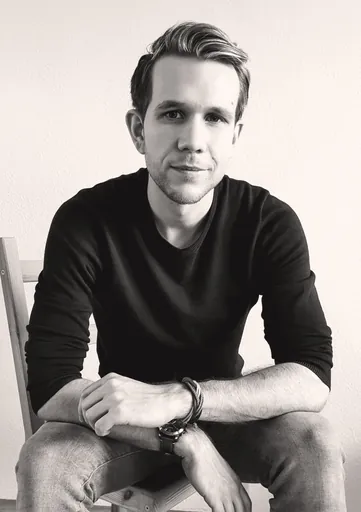

---
hide:
    - footer
    - feedback
---

{ width="256px"}

> "**Hope** for the best, **prepare** for the worst"

===+ "💼 Professional"

    > I consider myself a **wholistic senior QA-, Agile- and Knowledge-Manager/Coach** with backgrounds as **Fullstack Tech Lead** and in **E-Com, Mobility and Games Development**. With **Structure, Ownership, transparent Democratic Leadership and Continuous Improvement** as driving values, I aim to tackle cross-cutting issues for **lasting Impact** at my clients proactively.

    **Resume** [:fontawesome-brands-linkedin: LinkedIn](https://www.linkedin.com/in/philipp-kopp-5b23a912a/)

    Working at [Netlight](https://www.netlight.com/) for many years now, due to awesome personal, supportive and knowledge sharing driven culture 💜

    === "🧠 Expertise"
        - **Roles**
            - QA | Agile | Knowledge Manager & Coach
            - Cloud Architect & FullStack TechLead
            - Games Designer & Developer
        - **Domains**
            - E-Commerce, particularly Checkout & Payment
            - Mobility
            - Games
        - **Tech**
            - **App dev**: TypeScript NestJS, PHP Symfony, Postman, (previously: Golang, React, Java, Python, C#)
            - **Architecture**: Microservices, DDD / "Ports & Adapters", Event-driven (Kafka, Protobuf)
            - **Data**: Relational (PostgreSQL etc.), Document-based (MongoDB etc.), Key-Value/Cache (Redis etc.), ORM frameworks (TypeORM etc.)
            - **Payment**: PayPal, Stripe, AmazonPay
            - **Quality**: Many Unit/E2E/UI testing frameworks (PHPUnit, Jest, Puppeteer, etc.), load testing (k6.io), pen testing (OWASP), code quality/linting tools, chaos engineering, Xray, Gherkin, GDPR
            - **Monitoring**: DataDog, Grafana, Prometheus, Kibana/ELK, Sentry.io
            - **Cloud**: AWS, K8s, Jenkins/GitLab/GitHub/TeamCity CI/CD, Docker, Helm, Istio
            - **Documentation**: PlantUML, C4, OpenAPI, MkDocs, Obsidian.md, draw.io, Confluence, JIRA, CoPs
            - **Games**: Godot
    === "📜 Values"
        - Quality & Detail
        - Analysis, Planning, Structure & Coordination
        - Creativity through Diversification
        - Responsibility & Ownership
        - Knowledge Management & Continuous improvement
        - Democratic-Autocratic leadership style (lead by example but trust the team), valuing transparency
        - Focus on Cross-cutting concerns
    === "⭐ USPs"
        - Experience in many areas as well as democratic leadership ensures **creative, innovative solutions**
        - Passion for knowledge sharing, structure and processes as part of continuous improvement ensures **lasting impact beyond** short term **individual contribution**
        - **QA focus** pairs well with natural aptitude for detail, analysis, planning and structure
        - Strong sense of **ownership & responsibility** ensures tasks can be entrusted, while transparency and risk management ensures bad situation are handled well
        - Passion for **continuous improvement** and optimization drives **proactive initiative**

=== "❤️ Private"

    !!! info "Outgoing links"

        I like to support my favorite products and services by linking, though I don't have any affiliate relationships with any atm

    > "Writing equals thinking" - Jordan Peterson

    - 📈**Personal development & Life**
        - **Sports**
            - **Calisthenics (Strength)** at home with program from [Calisthenics Movement](https://www.calimove.com/p/complete-calisthenics-level-1-5)
            - **Yoga (Mobility)** with [down dog](https://www.downdogapp.com/) - ideally short daily session
            - **Gymnastics/Tricking (Cardio/Skill)** as long term member of [Free Arts of Movement "FAM"](https://www.freeartsofmovement.com/)
        - **Habits & Goals**: defining and tracking goals in 3 main areas **"Physical/Mental Health", "Social/Romantic Relationships" and "Career/Business"** every few months and using and reviewing daily [***"atomic"* habits/systems**](https://jamesclear.com/atomic-habits) to get there        
        - **Learning/knowledge building**: Maintaining a [**second brain**](https://www.buildingasecondbrain.com/) with [Obsidian.md](https://obsidian.md/) also this website (made with [MkDocs](https://squidfunk.github.io/mkdocs-material/)) to ensure I don't forget but continuously build upon things I learn and experience by "writing stuff down", sharing and thus reflecting on it. [**Spaced Repetition**](https://ncase.me/remember/) then automates the process of regular reviews for optimal retention
        - **Financial**: strong believer in **passive investing** as the only sane, practical, time/cost efficient and not to mention scientific way to invest. Highly recommend [Souverän investieren](https://www.amazon.de/Souver%C3%A4n-investieren-Indexfonds-ETFs-Book/dp/3593508524)/ the ETF-based [globally diversified portfolio](https://www.justetf.com/en/academy/how-to-get-a-globally-diversified-portfolio-with-just-one-etf.html) approach
        - **Psychology**: I find it fascinating **unintuitive** the **brain** often works and thus how much there is **gain from understanding** it. My favorite **concepts** being:
            - [non-judgemental mindfulness](https://en.wikipedia.org/wiki/The_Power_of_Now) / meditation / ignoring "monkey brain"
            - positive reinforcement via [lofty questions](https://blog.mindvalley.com/lofty-questions/) and future self/goal visualization, carrots and sticks for habits & commitment devices as well as momentum effect & getting started effect
            - happiness through exercising, healthy eating and sleep as well, practising gratitude and investing in relationships
    
    > "Medicine, law, business, engineering, these are all noble pursuits, and necessary to sustain life. But poetry, beauty, romance, love, these are what we stay alive for." ― Dead Poet’s Society
    
    - 🎲**Tech & Fun**
        - **Audio**: really enjoy the immersive sound good 2.1 speakers can deliver (fan of [Eve Audio](https://eve-audio.com/index.php?page=SC305)) and owning more headphones than my flat has rooms - favorite ones still being some modded [Koss Porta Pros](https://koss.com/products/porta-pro), which also serve as warming ear pads in the winter
        - **Video games**: nowadays I enjoy the never ending technical and broad artistic challenges of (2D) **video game creation** with [Godot](https://godotengine.org/) often more than actually playing games. Though I still like to play old games e.g. from [myabandonware.com](https://www.myabandonware.com/) or newer **retro and/or indie** games for the nostalgic feeling and inspiration that either challenge my **reaction/dexterity** via action or thinking in turn-based **strategy**
        - **Physical Games**: from >100 board games, park games from Speedball over Frisbee to Kubb or Mölkky as well as escape games with friends - I like to **experience and analyze game mechanics** in all shapes and forms
    - 🛠️**DIY**
        - **Electronics & (light) engineering**: e.g. power banks & solar stuff, smart home sensors, small electric tools like drills, wearable cameras for action recording, folding bedside TV...
        - **Repairing** anything from household appliances over clothes to plumbing
        - **Artsy stuff**, like small wooden/metal jewelry or lamps
        - **Furniture making & home improvement**: like to combine light wood and linen, black metal and artificial plants (even my indoor floor is artificial grass :D). Highly recommended: [SketchUp free](https://www.sketchup.com/de/plans-and-pricing/sketchup-free)
        - **Food & Cooking**, like to experiment in the direction of **molecular gastronomy**, also practising **intermittent fasting**; addicted to **sweet stuff**, thus e.g. making lots of DIY ice cream

=== "🙏 Support"

    Creating free content takes 💵 money (e.g. hosting this site) and 💪 effort.

    If you like, you can support me via [:fontawesome-brands-paypal: PayPal](https://paypal.me/PhilMKopp)

=== "✉️ Contact"

    <form action="https://formspree.io/f/xnqklzja" method="POST" style="font-size: medium;">
    <label>
        Your contact (optional):
        <input type="text" name="contact" placeholder="E.g.: your@email.com" style="width: 100%;">
    </label>
    <label>
        Your message:
        <textarea name="message" placeholder="Your message" style="width: 100%; height: 256px;" required=""></textarea>
    </label>
    <input type="submit" value="Submit">
    </form>