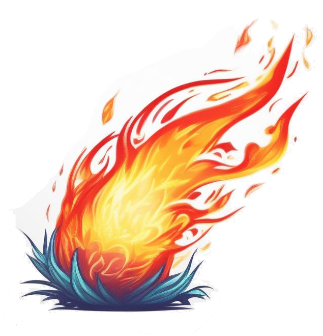
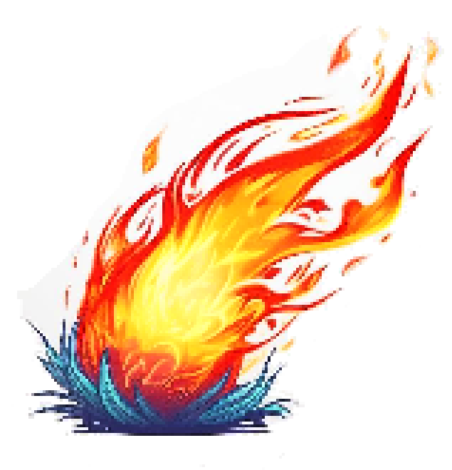

<figure markdown>
  {: loading=lazy}
  <figcaption>Preview sample of <a href="https://clockworkraven.itch.io/raven-fantasy-icons">"Raven Fantasy Icons"</a> of  from Clockword Raven</figcaption>
</figure>

- How and why this website came to be

<!--more-->

---

## Tools

- [Stable Diffusion (Web)](https://stablediffusionweb.com/#ai-image-generator): open source AI image generator. Local install is recommended for greater control, e.g. using installer from [AUTOMATIC1111](https://github.com/AUTOMATIC1111/stable-diffusion-webui)
- [paint.NET](https://www.getpaint.net/index.html): open source image editing software, e.g. similar to Photostop, but more simple. 
- [2D-Image and Texture Filter / "2dimagefilter" from Hawkynt](https://github.com/Hawkynt/2dimagefilter): small tool offering large collection of image scalers and filters. Available standalone (recommended) or as paint.net plugin

## Generic image to pixel/low-fi art techniques

- Color quantization / restricted palette: usually last to ensure restricted palette
  - posterize
- Color dithering
- Pixelation / Mosaic
  - in paint.NET: uses selected filter method to downsample by given factor of 2, then uses nearest-neighbour to scale up to original size
  - nearest-neighbour: "pixel perfect"
  - bilinear vs cubic: cubic is slightly sharper
  - multi bilinear: quite blurry
- Saturation & contrast
- Sharpness / clarify
- Blur
- "Brush" filters

### Outline

- Outline / Edge detection / High Pass (copy layer first and apply effects to top layer)
- Inverting colors might be necessary to get black lines on white ground

- Use color quantization, high contrast etc. to increase sharpness of the outlines 

| Quantized outline | High contrast outline |
| :---------------: | :-------------------: |
|  |     |

- Multiply-overlay the outlines with the image
- Layer-merge outline with image to be able to apply effects to the image incl. outline

## Pixel art scalers

### The scaling dilema

<figure markdown>
  {: loading=lazy}
  <figcaption>Preview sample of <a href="https://clockworkraven.itch.io/raven-fantasy-icons">"Raven Fantasy Icons"</a>, by Clockword Raven</figcaption>
</figure>

Pixel art icons in game asset packs often come in quite **low resolutions**, e.g. 16x16, 32x32 or 64x64. 16x16 art is the cheap to produce or buy in large quantities, making it a great starting point in that regard. It's of course part of the appeal of pixel art that while most individual pixels are placed with much care - the art as a whole is supposed to be viewed "from a distance" exactly so that individual **pixels can't be distinguished and the brain can and must creatively make up the "missing" details**. However **16x16 is positively tiny** and will be hard to see at all on modern high DPI displays:

So if meant to be used **for anything else but thumbnails**, even in pixel art projects icons are usually scaled to 32x32 or 64x64. This is most commonly done using "pixel perfect" / "nearest neighbour" **scaling**, as seen in the larger preview above.

Independent of artistic taste, this **blocky appearance is problematic if up/down-scaled by a factor different than 2**. This will happend all the time if game using any kind of smooth camera zooming. E.g. mid zoom, a **150% nearest-neighbour scaling** is forced to enlarge some pixels but not others, yielding a weird **mixture**:

On the other hand, if **filtering** (e.g. bilinear interpolation[^bilinear]) is used to avoid those visible pixel mixtures, the resulting **blurring** will lead to mushy icons, losing most of their original intricate details:
[^bilinear]: [https://en.wikipedia.org/wiki/Bilinear_interpolation](https://en.wikipedia.org/wiki/Bilinear_interpolation)

!!! info

    You might even see filtering in action right now for all images here if your screen is to small to display the images in full size.

### Using dedicated pixel art scalers

[2dimagefilter](https://github.com/Hawkynt/2dimagefilter) offers a wide variety of image filters and **dedicated scaling algorithms specifically for pixel/retro art**. Among the most **popular** are:

  - **Scale2x**: sharp upscaler
  - **Eagle**: sharp upscaler
  - **HQ2X**: sharp with slight blur, more blocky
  - **Lanzcos**: improvement over e.g. bilinear filtering

If also like:

  - **EPXB**: sharpest upscaler
  - **XBR2x (no blend)**: sharper upscaler
  - **XBR2x (with blend)**: blurry and very rounded
  - **XBR4x (with blend)**: sharp and rounded
  - **AdvInterp2x**: sharp with slight blur
  - **EPXC**: sharp with slight blur
  - **HQ2X bold**: blurry

!!! warning

    Before pixel art scalers can be effectively applied, you need to **make sure that the source material isn't** already nearest-neighbour **pre-scaled**. If you e.g. Scale2x pixel art at 400% you will just blow up the pixels and slightly round their edges. While non-scaled the result is a more cell-shaded look like originally intended.

    |         Pre-scaled         |         Non-scaled         |
    | :------------------------: | :------------------------: |
    |  |  |

    Sometimes scalers also have difficulties with transparent backgrounds (black outlines will bleed out sharply) but not with white backgrounds.
    

Since the tool is free and easy to use, I encourage you to just try out all options yourself. I recommend the following **extra settings**:

  - View -> Source Image -> "Fit": will show the input image scaled using filtering
  - View -> Target Image -> "Actual": let's you inspect the resulting image in full detail
  - Advanced -> Use Thresholds -> off: not sure how it works, but I usually get worse results when it is on, e.g. bleeding outlines with HQ4X:

Note that **applying** e.g. **HQ2X two times** (e.g. via using repeat=2 or using the "repeat" button) **is different to using HQ4X** only once - upscalers like Scale2x, that preserve sharp color separation, with produce an increasingly harsh look if applied multiple times while upscalers like HQ2X, that add a bit of blur, will get blurrier accordingly, while HQ4X alone might not introduce any visible blur. By doing the **"resize"** with one method and then doing a **"repeat"** with another method, you get more **fine-grained control over blur/sharpness**.

### My favourite methods

**2x EPXB**: very sharp look. E.g. the sandwich bread or the grapes look like they have small triangular artifacts

**2x XBR2x (no blend)**: sharp look, bit more rounded 

**2x AdvInterp2x**: slight blur, somewhat of a middle ground between sharp and blurry look. E.g. the magic effect/crosshair directly left of the golden armor is not handled well and bloody scrathes directly right of it also look weird

**AdvInterp2x -> EPXC**: moderate blur, still with bit of sharpness

**XBR2x -> AdvInterp2x**: blurry first pass and less blurry second pass. Really doesn't work well where there's no black outline as the icon is blurred into the background. But most other icons e.g. the egg toast or blue robe look very consistent

**XBR4x**: very rounded, but without blur

### AI upscaling

4x scaling right from 16x16 results in blocky smudges and especially the outlines are very hard blocky:

If the icons are pre-scaled with blur like XBR2x, then another pass with Waifu2x (no denoise) gets us a results quite similar to XBR4x, however with more "fluidity", as e.g. visible with the jellyfish or the bloody dagger

## AI art to pixel art

### 3d to pixel art

[PoseMy.art](https://app.posemy.art/)

| 3D model screenshot | Pixelated -> quantized |
| :-----------------: | :--------------------: |
|          |       |

[Kenney Shape](https://kenney.nl/tools/kenney-shape)

| 3D model screenshot | Pixelated -> quantized |
| :-----------------: | :--------------------: |
|       |    |

### Large/full-screen art

Original image:

"grass plain, magic tower, fantasy world, (birds:0.3), (travelers:1.3), god rays, afternoon, illuminated (purple clouds:0.5), masterpiece, highly detailed"

- Color quantization: Octree, 48 colors, no dither

Difference between sharp nearest-neighbour and more blurry bicubic pixelation is barely noticable after color quantization

|     Nearest -> Quantize      |     Bicubic -> Quantize      |
| :--------------------------: | :--------------------------: |
|  |  |

The difference between Octree and Median Cut quantization is I think a matter of taste. To me Median Cut seems to produce harsher colors reminding my of older console palettes like with the Commodore 64

|       Quantize: Octree       |     Quantize: Median Cut      |
| :--------------------------: | :---------------------------: |
|  |  |

The difference in ordering color quantization and pixelation hardly makes a difference, especially when using nearest-neighbour scaling. With blurrier methods like (multi) bilinear or bicubic, scaling after quantization smoothes over the hard edges that the quantization procudes especially in the sky, though the distinct "color steps" are still quite visible. Dithering is probably preferably here, since smooth edges but visible color steps don't seem like a nice combination

|     Multi-bilinear -> Quantize      |     Quantize -> Multi-bilinear      |
| :---------------------------------: | :---------------------------------: |
|  |  |

While color quantization alone yields the same results on a nearest-neighbour downscaled vs. pixalated image, the dithering effect will apply quite different to a smaller downscaled image compared to a large pixelated image:

| Downscale 25% -> Dither 4  | Pixelate 4x/25% -> Dither 4 |
| :------------------------: | :-------------------------: |
|  |   |

|   Dither 18 colors   |   Dither 48 colors   |
| :------------------: | :------------------: |
|  |  |

|  Gauss Blur -> Dither   |     Nearest -> Dither      | 
| :---------------------: | :------------------------: | 
|  |  | 

|    Nearest -> Oil -> Dither    | Oil -> Nearest -> Dither |
| :----------------------------: | :----------------------: |
|  |    |

### Small-medium art/sprites

#### **1. Generate image**

- Example **prompt**: "fire ball spell sprite, flame, effect, game asset, white background, cell shaded, thick lines"
  - **negative**: "(wood:1.5), (metal:1.2), (shadow:1.2), (flash:1.2), (rock:1.2)"
  - **style**: "game-rpg fantasy game"

#### 2. Sharpness and contrast

As pixel art is done with restricted color palettes, each color needs to have value and purpose and the pallete as a whole also needs to be flexible enough to typically display a wide variety of objects nicely. Thus, such color palettes tend to have high contrast, so that details can be visible even on a small scale.

- Highlights / Shadows -> Clarity
- Contrast
- Saturation

#### 3. Pixelate

Cell size = 4 (= downscale to 25%)

Options:

- Sharp (nearest-neighbour) or blurry (bilinear, cubic etc.)

#### 4. Quantize colors

- Use as few colors as possible to keep the look clean
- A shaper look works better with a few more colors to preserve fine details
- 

| Vibrant & sharp |    Vibrant & blurry     |
| :-------------: | :---------------------: |
|  |  |

 |  Low contrast & blurry  |     Low contrast & dither      |
 | :---------------------: | :----------------------------: |
 |  |  |

| 100% outline, sharp & few colors |     50% outline, blurry & more colors     |
| :------------------------------: | :---------------------------------------: |
|                |  |

|       Sharp        |       Blurry        |
| :----------------: | :-----------------: |
|  |  |

