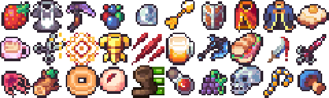
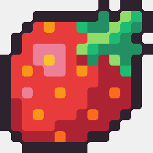
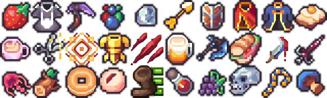
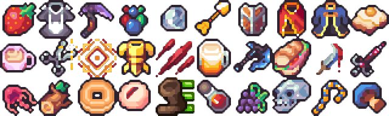
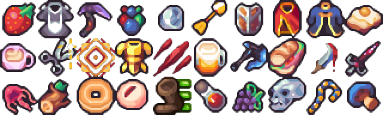

<figure markdown>
  {: loading=lazy}
  <figcaption>Preview sample of <a href="https://clockworkraven.itch.io/raven-fantasy-icons">"Raven Fantasy Icons"</a> of  from Clockword Raven</figcaption>
</figure>

- How and why this website came to be

<!--more-->

## Tools

- [Stable Diffusion (Web)](https://stablediffusionweb.com/#ai-image-generator): open source AI image generator. Local install is recommended for greater control, e.g. using installer from [AUTOMATIC1111](https://github.com/AUTOMATIC1111/stable-diffusion-webui)
- [paint.NET](https://www.getpaint.net/index.html): open source image editing software, e.g. similar to Photostop, but more simple. 
- [2D-Image and Texture Filter / "2dimagefilter" from Hawkynt](https://github.com/Hawkynt/2dimagefilter): small tool offering large collection of image scalers and filters. Available standalone (recommended) or as paint.net plugin

## Generic image to pixel/low-fi art techniques

- Color quantization
- Color dithering
- Sharpening
- "Brush" filters

## Pixel art scalers

### The scaling dilema

<figure markdown>
  {: loading=lazy}
  <figcaption>Preview sample of <a href="https://clockworkraven.itch.io/raven-fantasy-icons">"Raven Fantasy Icons"</a>, by Clockword Raven</figcaption>
</figure>

Pixel art icons in game asset packs often come in quite **low resolutions**, e.g. 16x16, 32x32 or 64x64. 16x16 art is the cheap to produce or buy in large quantities, making it a great starting point in that regard. It's of course part of the appeal of pixel art that while most individual pixels are placed with much care - the art as a whole is supposed to be viewed "from a distance" exactly so that individual **pixels can't be distinguished and the brain can and must creatively make up the "missing" details**. However **16x16 is positively tiny** and will be hard to see at all on modern high DPI displays:

So if meant to be used **for anything else but thumbnails**, even in pixel art projects icons are usually scaled to 32x32 or 64x64. This is most commonly done using "pixel perfect" / "nearest neighbour" **scaling**, as seen in the larger preview above.

Independent of artistic taste, this **blocky appearance is problematic if up/down-scaled by a factor different than 2**. This will happend all the time if game using any kind of smooth camera zooming. E.g. mid zoom, a **150% nearest-neighbour scaling** is forced to enlarge some pixels but not others, yielding a weird **mixture**:

On the other hand, if **filtering** (e.g. bilinear interpolation[^bilinear]) is used to avoid those visible pixel mixtures, the resulting **blurring** will lead to mushy icons, losing most of their original intricate details:
[^bilinear]: [https://en.wikipedia.org/wiki/Bilinear_interpolation](https://en.wikipedia.org/wiki/Bilinear_interpolation)

!!! info

    You might even see filtering in action right now for all images here if your screen is to small to display the images in full size.

### Using dedicated pixel art scalers

[2dimagefilter](https://github.com/Hawkynt/2dimagefilter) offers a wide variety of image filters and **dedicated scaling algorithms specifically for pixel/retro art**. Among the most **popular** are:

  - **Scale2x**: sharp upscaler
  - **Eagle**: sharp upscaler
  - **HQ2X**: sharp with slight blur, bit blocky
  - **Lanzcos**: improvement over e.g. bilinear filtering

If also like:

  - **EPXB**: sharpest upscaler
  - **XBR2x (no blend)**: sharper upscaler
  - **XBR2x (with blend)**: blurry and very rounded
  - **XBR4x (with blend)**: sharp and rounded
  - **AdvInterp2x**: sharp with slight blur
  - **EPXC**: sharp with slight blur

!!! warning

    Before pixel art scalers can be effectively applied, you need to **make sure that the source material isn't** already nearest-neighbour **scaled**. If you e.g. Scale2x pixel art at 400% you will just blow up the pixels and slightly round their edges. While non-scaled the result is a more cell-shaded look like originally intended.

    |           Scaled           |         Non-scaled         |
    | :------------------------: | :------------------------: |
    |  |  |
    

Since the tool is free and easy to use, I encourage you to just try out all options yourself. I recommend the following **extra settings**:

  - View -> Source Image -> "Fit": will show the input image scaled using filtering
  - View -> Target Image -> "Actual": let's you inspect the resulting image in full detail
  - Advanced -> Use Thresholds -> off: not sure how it works, but I usually get worse results when it is on, e.g. bleeding outlines with HQ4X:

Note that **applying** e.g. **HQ2X two times** (e.g. via using repeat=2 or using the "repeat" button) **is different to using HQ4X** only once - upscalers like Scale2x, that preserve sharp color separation, with produce an increasingly harsh look if applied multiple times while upscalers like HQ2X, that add a bit of blur, will get blurrier accordingly, while HQ4X alone might not introduce any visible blur. By doing the **"resize"** with one method and then doing a **"repeat"** with another method, you get more **fine-grained control over blur/sharpness**.

### My favourite methods

**2x EPXB**: very crisp look. E.g. the sandwich bread or the grapes look like they have small triangular artifacts

**2x XBR2x (no blend)**: crisp look, bit more rounded 

**2x AdvInterp2x**: slight blur, somewhat of a middle ground between sharp and blurry look. E.g. the magic effect/crosshair directly left of the golden armor is not handled well and bloody scrathes directly right of it also look weird

**AdvInterp2x -> EPXC**: moderate blur, still with bit of sharpness

**XBR2x -> AdvInterp2x**: blurry first pass and less blurry second pass. Really doesn't work well where there's no black outline as the icon is blurred into the background. But most other icons e.g. the egg toast or blue robe look very consistent

**XBR4x**: very rounded, but without blur

## AI art to pixel art

### **1. Generate image**

- Example **prompt**: "fire ball spell sprite, effect, game asset, white background"
  - **negative**: "wood, metal, shadow, flash"
  - **style**: "game-rpg fantasy game"

### 2. 1st color quantization

### 3. Filtered downscaling

- bicubic (crispier than bilinear)

### 4. Pixel upscaling

- XBR2x -> AdvInterp2x

### 5. 2nd color quantization

#### Quantization comparison

|  Colors = 9  |  Colors = 11  |  Colors = 13  |
| :----------: | :-----------: | :-----------: |
|  |  |  |

#### Dithering comparison

|  Level = 0   |   Level = 4   |   Level = 8   |
| :----------: | :-----------: | :-----------: |
|  |  |  |

