- Main point is not decluttering but improving focus and intention in life
- My journey: from hoarding DIYer down to 2 spoons in the drawer
- Benefits and caveats: e.g. new apartment without moving but also psychological impact
- Practical methods and mindsets: from the box method(s) to future self

<!--more-->

---

## **What** is Minimalism?

I define it as:
> Have only what is **essential for your target identity** to live with **more purpose, freedom, and force.**

### What it's **not**

- **A one-time** purge - but a lifestyle.
- Owning **as little as possible** for its own sake.
- **Organisation**: optimising clutter.
- **Frugality**: spend less.
- **Deprivation**: do without.

So the **oppositive is not abundance, but rather excess without purpose** (for you). Meaning e.g. jogging is not "more minimalist" than skiing, even though skiing requires much more gear. What matters is whether something is essential for your target identity.

### **Why** It Matters

- Modern life wants us to **consume** and overloads us with products, trends and experiences to try.
  - This costs **time, money, and focus for things that matter to you** - up front and ongoing.
  - For example, through **storage, maintenance, cleaning, clutter, organisation, decisions, guilt...**

> Many people spent 2h to "save 2€" - minimalism can save you both the all the money and time. And even an inherited (free) guitar even while not played still costs focus.

### Core Principles

- **Essential** and **enough.**
- **Space as value.**
- **Quality** over quantity.
- **Future** over past self.

## My Story

### Trigger (**2010-2017**)

- First larger hobby budget for **electronics and DIY projects.**
- More tools, parts, and know-how felt like **independence and control.**

> I don't regret the knowledge I aquired, but I lost freedom and control.

<figure markdown>
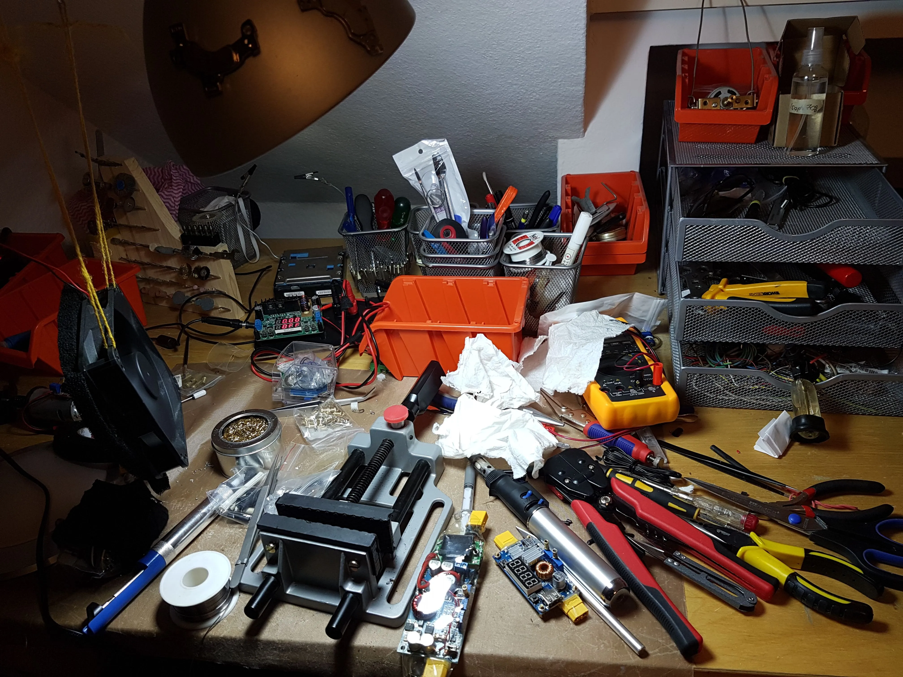{width=75% loading=lazy}
</figure>

### Trigger (**2018-2023**)

- Boxes were overflowing - **sorting new things into old clutter got hard.**
- Keeping everything usable felt like it cost **1-2h every weekend** in organisation and maintenance.
- Uncanny feeling of the stuff in the room **exerting pressure**, making it hard to breathe.

> Visitors gasped at the sight.

<figure markdown>
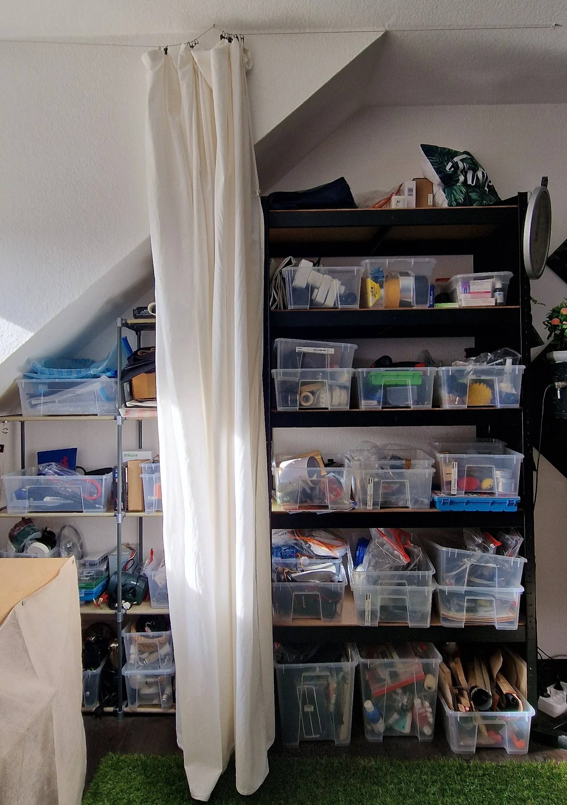{width=50% loading=lazy}
</figure>

### Trigger (**2024**)

- Cellar flooding **destroyed** a lot of **"might still need it later" stock**.
- The cleanup **felt like wasted time** before things could be replaced.

> Only later did I realize this was a blessing and in fact an effective decluttering method, not a curse.

<figure markdown>
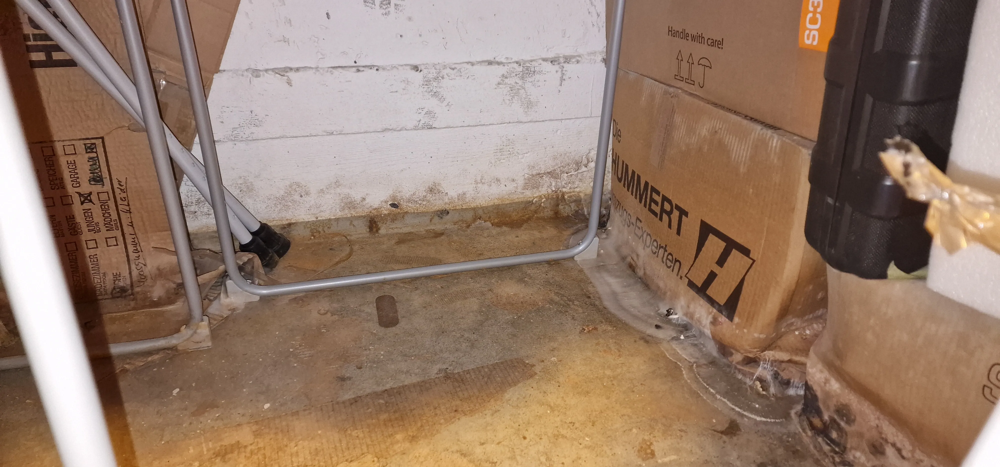{width=50% loading=lazy}
</figure>

<figure markdown>
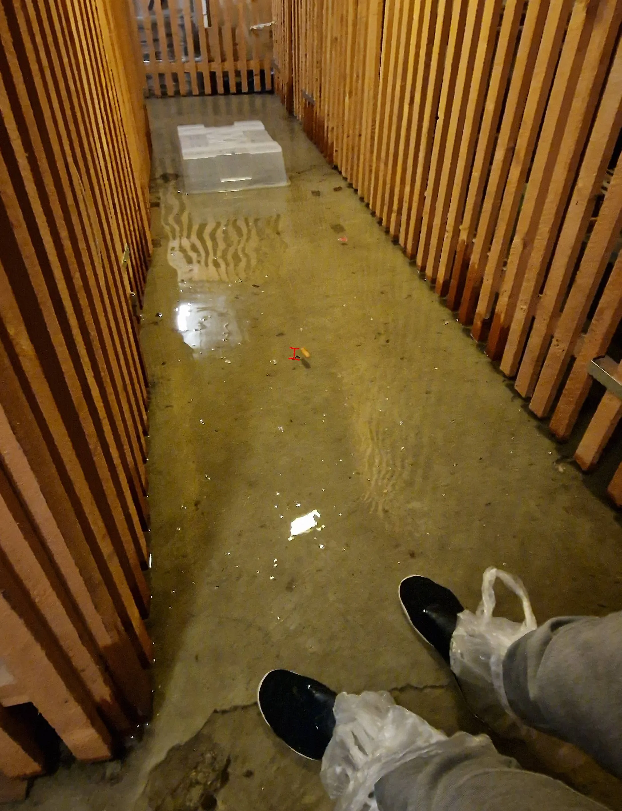{width=50% loading=lazy}
</figure>

> In the end, **none of it had to be replaced.**
>
> Freeing up a **whole small room.**
> 
> So what if **I kept going?**

## The Purge

### Process: ***"Identity decluttering"***

Decluttering e.g. via KonMari "Does it bring joy?" helped me **understand how I felt about the activities behind things** and thus in return declutter my identity.

> After decluttering my leatherworking tools and materials, I realized it was just a phase - or at least nothing I wanted to have as part of my core identity.

<figure markdown>
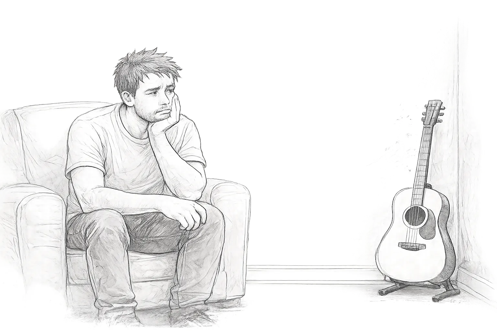{width=75% loading=lazy}
</figure>

### Process: **Iterations**

Needed multiple passes through all things while **letting a new baseline settle** and **putting things on trial in boxes.**

> A newly decluttered space looks clean a first - but once everything has been decluttered to the same standards you might perceive a new mess behind the original mess.

<figure markdown>
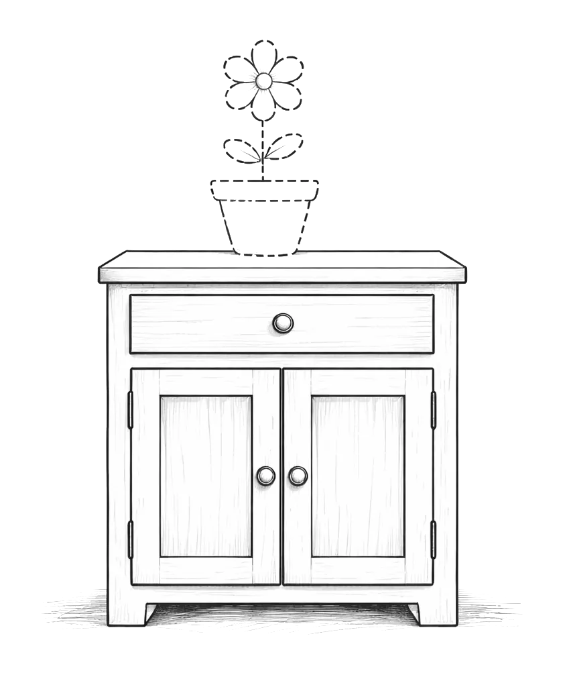{width=50% loading=lazy}
</figure>

### Process: **Exhausting**

Especially sentimental items left me ***mentally beat*, depressed and indecisive** for the day after only 2-3h.
(psychological principl: "loss aversion")

> Decluttering childhood items felt like loosing a limb.

<figure markdown>
{width=50% loading=lazy}
</figure>

### Process: **Addictive**

With every trash bag closed up, **letting go became easier** and **satisfaction about optimization grew.**

<figure markdown>
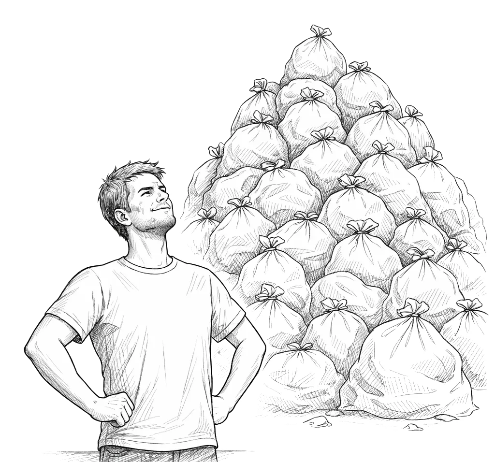{width=50% loading=lazy}
</figure>

### Process: **Mistakes**

Needed to **replace ~50 EUR**, some items even days after tossing them - still **gained valuable insights.**

<figure markdown>
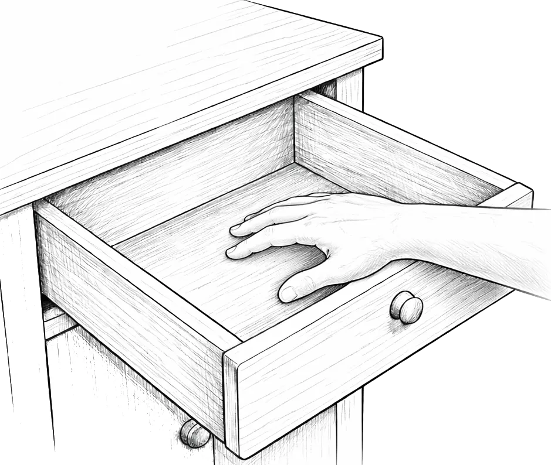{width=50% loading=lazy}
</figure>

### Outcomes: **Space**

- **No need for larger flat** and more freedom to **re-arrange** room.
- More freedom to **reserve space for habits.**

> Felt like I moved to a new flat.

<figure markdown>
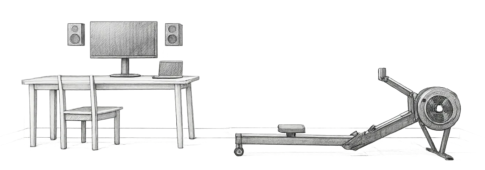{width=100% loading=lazy}
</figure>

### Outcomes: **Optimized creator flows**

- Traded massive stockpiles "bought at discount and cheap slow shipping" for **faster access to higher-quality, purpose-bought items** at a slight premium.
- **Weekends can go to projects** instead of maintenance.

<figure markdown>
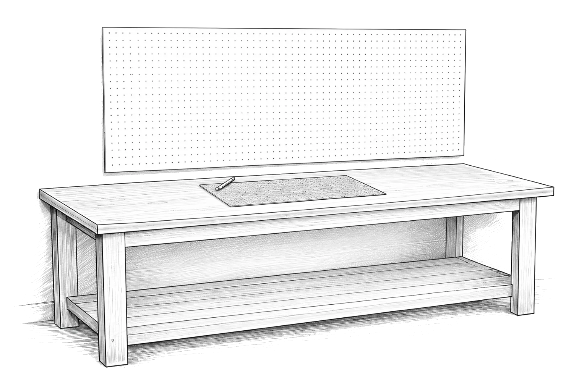{width=75% loading=lazy}
</figure>

### Outcomes: ***stronger* life**

- Feeling more **alive and in control** by spending more time with **intent, purpose and together with loved ones.**
- Increase **hapiness / reduced envy and greed** through clearer **identity, what's enough and understanding hidden costs.**

> It's not that you get a better grip on envy and greed - they fundementally stop making sense even for desirable things once you understanding the hidden consts in everything.

<figure markdown>
{width=75% loading=lazy}
</figure>

## How to Practice It

### Identity: *What you want to do?*

Open up to a new **target self first.**
Not through what you already have but:

- **Hobbies**
- **Habits**
- **Profession**
- **Relationships**

This though takes **time, exploration, and iteration.**

> If you cycle 20h/week on a shitty bike, you're a serious cyclist.
> A wannabe only spents 30min on an expensive one.

<figure markdown>
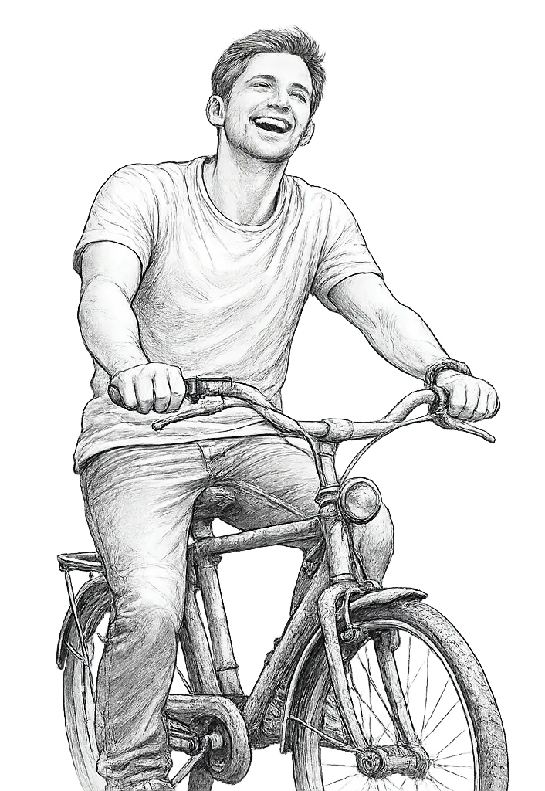{width=50% loading=lazy}
</figure>

### Decluttering: **General**

- Declutter by **type** (e.g. all kids toys), not by area.
  - Because e.g. unless you want scissors in every room, rather collect them all in store a good pair centrally.
- **Touch things only once**, and sort into: **toss, donate(5-20€)/sell (>20€), keep/trial.**
- **Visible wins** and **prevent 2nd guesses**: things need to leave quickly and often.

<figure markdown>
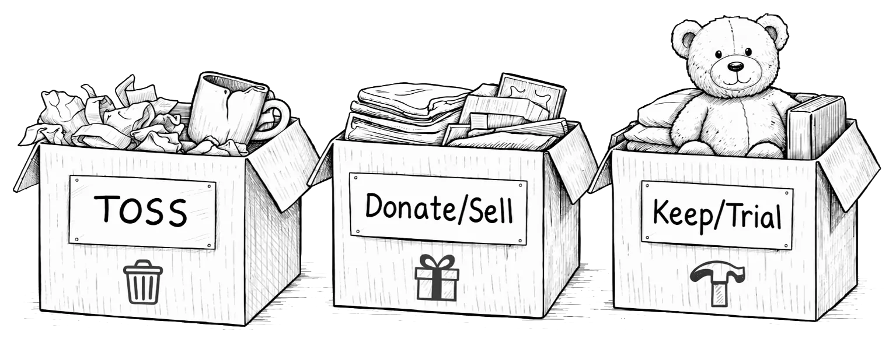{width=100% loading=lazy}
</figure>

### Decluttering: **Filters**

Assume things are **not essential by default** - meaning everything an explicit reason to stay rathan than leave.

- Would you **clean it if filthy/buy it again?**

> Critically, for me the answer to all my moldy stuff in the basement was "no".

- ~~Not: "Why can this go?",~~ but: **"Why should this stay?"**
- ~~Not: "When could I need it?"~~, but: **"When did I last use it?"**
  - Estimating future need is hard, but looking back at actual (non-)usage nudge uncertainty through facts.

- **Does it have a place** you would intuitively look for it? Would you **remember having it when needed?**
  - This illustrates how everything in your life can degrade the value of everything else: even if useful, **if you can't remember** a thing or option you have in the moment of need - **it might as well not exist.**

- **Does it bring joy?**

> Looking back, I was puzzled but the amount of items I was holding onto that made me feel annoyed just thinking about them. At the very least, this is a clear indicator that investing into a fix will likely noticably improve your life quality. Cause directly increasing hapiness is hard to achieve reliably - but decreasing detrimental factors can often be done targeted.

<figure markdown>
{width=50% loading=lazy}
</figure>

### Decluttering: **Box Method**

- **Empty the container first** and put **back only what deserves** to stay.
- **If unsure**: store it **out of sight in the box.**
→ Let go if still there after 6 months, or 12 for seasonal items.

<figure markdown>
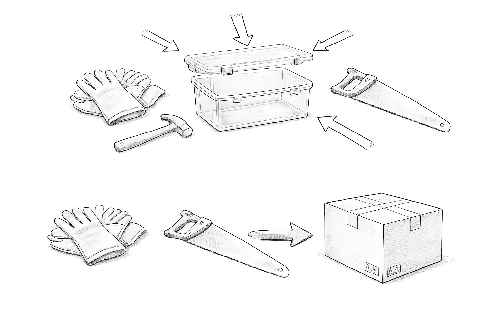{width=75% loading=lazy}
</figure>

### Decluttering: ***Radical Reset***

If you have be necessary staging space or guts, there's a **fast track**:
Put everything away (e.g. in storage container) and bring only back what you need.

<figure markdown>
  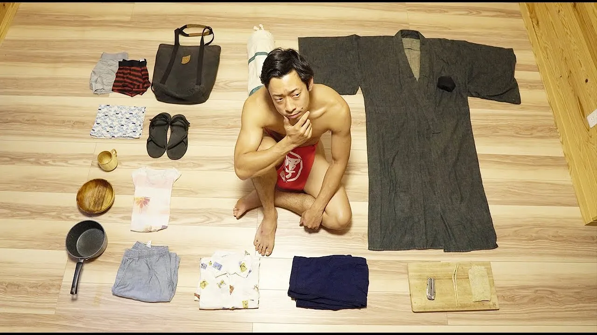{width=75% loading=lazy}
  <figcaption>Image from <a href="https://www.youtube.com/@SamuraiMatcha">@SamuraiMatcha</a></figcaption>
</figure>

### Decluttering: **Make and Repair**

- Stock only what serves **many projects** (e.g. common fasteners) - anything special you'll buy customised for projects anyway
  - Especially true for **salvaged parts** in degraded quality
  - Stock bought at **90% discount is still wasted if never used**
  - **Half the stock** of a category if not used for 6 months
- Repairs should be **fun or needed for critical usecases**, e.g. medical device

> Turns out many repairs are not time critical after all or in the end require special parts anyways. And you better know what you're doing when fixing your plumbing or medical without fear while you void you warranty.

### Decluttering: **Easy to hard categories**

**Learn** to declutter in **easy categories first**.

### **Easy**: Poor fit, outdated, etc.
- Clothes
- Documents, Books

### **Medium**: Potential value, but often overestimated.
- Electronics, Tools, Household
- Digital

### **Hard**: Guilt-laden, irreplaceable.
- Hobby equipment, Decoration
- Sentimental items

### Category: **Clothes**

- Anything not worn in **1 year**, **wrong size**, or **not target size.**
- If not **at least 90% as good as your favorite version.**
- **1-in-1-out** is essential here!

> Going on vacation with only your favorite clothes and rather relying on washing over larger quantities made me realize A) I also constantly rotate the same clothes at home B) identifying people by their clothes from yesterday is actually nice C) I'd pack a small container of detergent over 2-3x extra pants and shirts any time

<figure markdown>
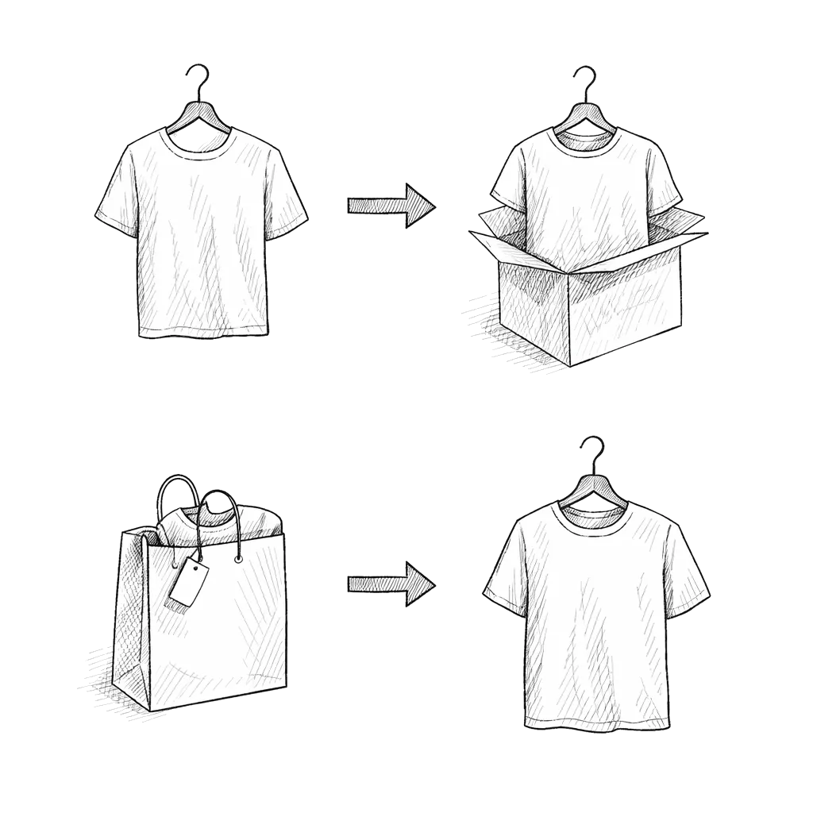{width=75% loading=lazy}
</figure>

### Category: **Tools, Gadgets, Parts etc.**

- Put in box and **only bring back if really needed.**
  - Not only will this make **actuall need** very clear but also **where there were needed.**
- Restriction fosters **creativity to use existing things** for more use cases.
- Only very **few tools are needed to cover most use cases** for at least 80% of outcome quality.

> That's were I don't regret my experience from experimenting with so many (often low quality) tools. Multi-use tools are often advocated by minimalists to save space, but I feel that's often just a convenient excuse for having additional functions "just in case" again. Specialised tools might provide superior utility in that one usecase that matters most to you - it's highly individual.

<figure markdown>
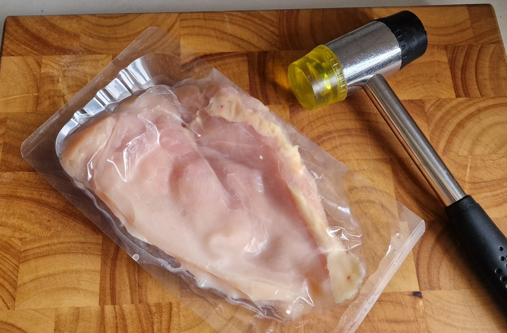{width=75% loading=lazy}
</figure>

### Category: **Digital**

- **Fewer files, accounts, subscriptions, etc.**
- Prefer desktop (**produce**) over mobile (**consume**).

**Lockouts**: Automate discipline.

- **Router/browser filters** for social media, etc.
- Bedtime: turn **router Wi-Fi** off & use **desktop shutdown/mobile lockout.**

{width=49% loading=lazy} 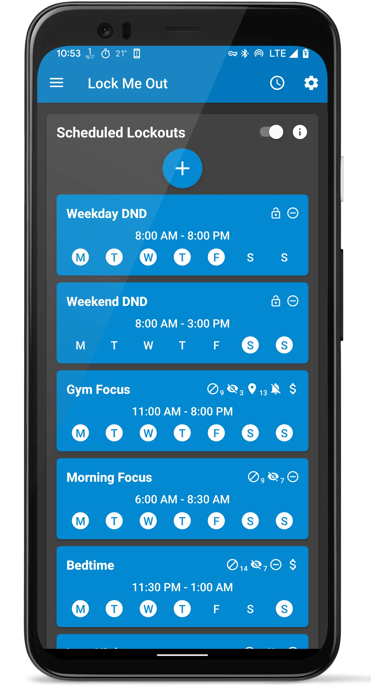{width=49% loading=lazy}

### Category: **Decoration and Sentimental Items**

- Decoration: give yourself **2-8weeks to appreciate the gained space** and let "loss of cosiness" fade away.
- Sentimental: take a photo and then put the thing away. After 1 year, **check if the photo is enough.**

<figure markdown>
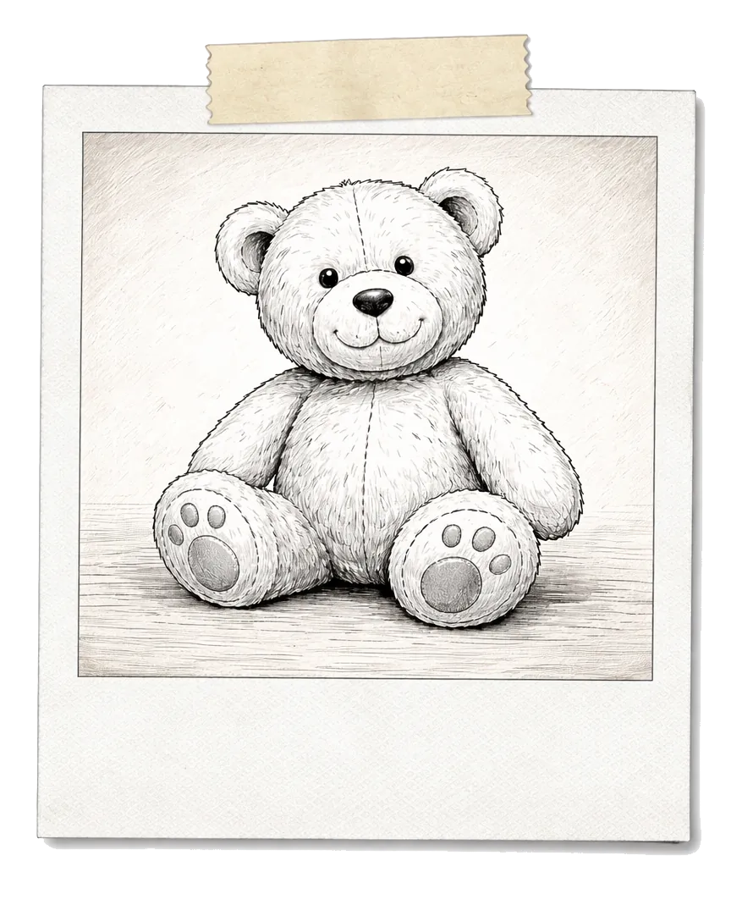{width=50% loading=lazy}
</figure>

### Minimalist **Buying**: keeping it clean

- **Delay purchases**: wishlist first, wait a few days/weeks.
- Buying **solutions to problems, e.g. what annoys you daily**, makes you a lot happier than buying *"new possibilities"* etc.
- Would you **buy it at a much higher price**?
- **1-in-1-out** (similar item!) prevents future clutter.
- Try a **no-buy-month**: learn satisfaction and creative alternatives

<figure markdown>
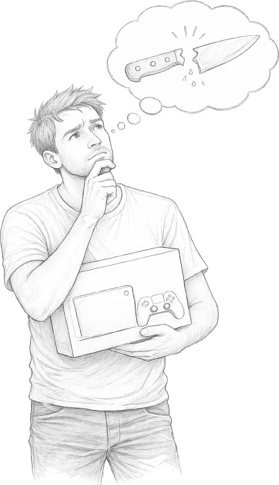{width=50% loading=lazy}
</figure>

## References and Influences

### Marie Kondo

<figure markdown>
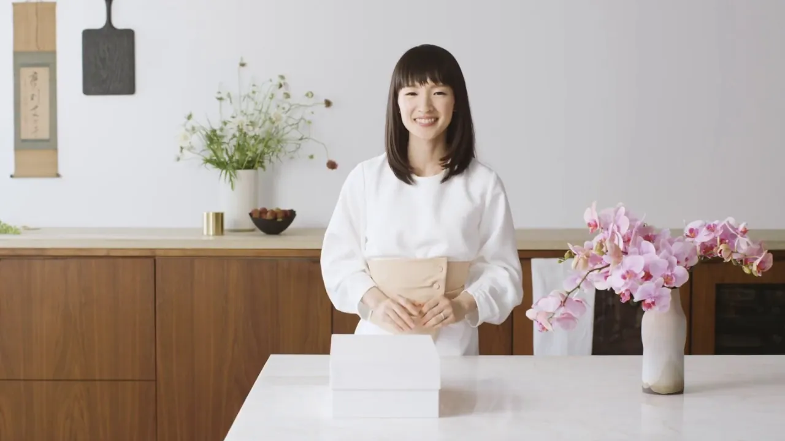{width=75% loading=lazy}
</figure>

https://www.youtube.com/watch?v=FipZIrwtADg

> "Does it bring joy?"

### Matt D'Avella

<figure markdown>
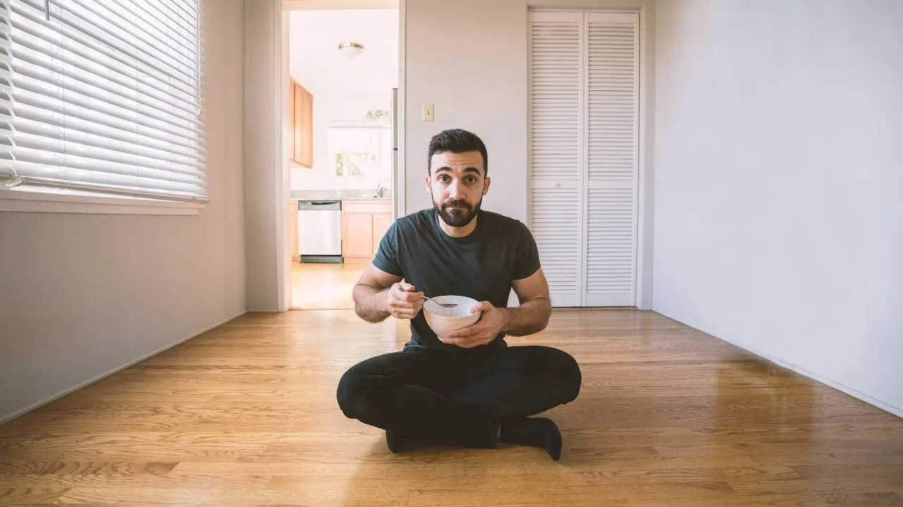{width=75% loading=lazy}
</figure>

https://www.youtube.com/watch?v=tG2GJZcBKOE

> "What about things that bring you joy?" - "I got rid of that as well."

### Joseph DeChangeman

<figure markdown>
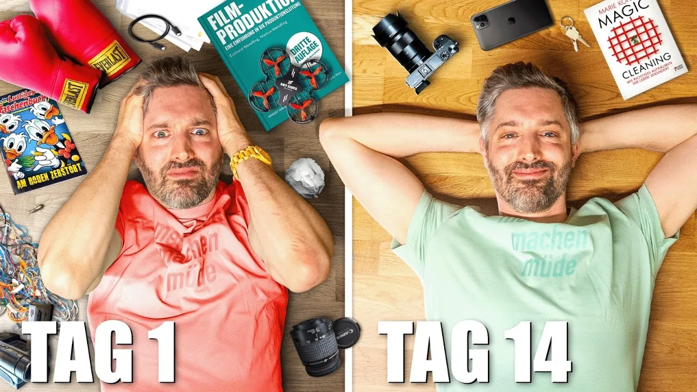{width=75% loading=lazy}
</figure>

https://www.youtube.com/watch?v=boYThAjUmsk

> Real talk on the emotional impact of going minimalist as a former hoarder

### Samurai Matcha

<figure markdown>
{width=75% loading=lazy}
</figure>

https://www.youtube.com/watch?v=0yiheVIx-X4

> 1 item per day for 30 days challenge: fastest possible path to extreme minimalism and appreciation of what one owns

### sibu

<figure markdown>
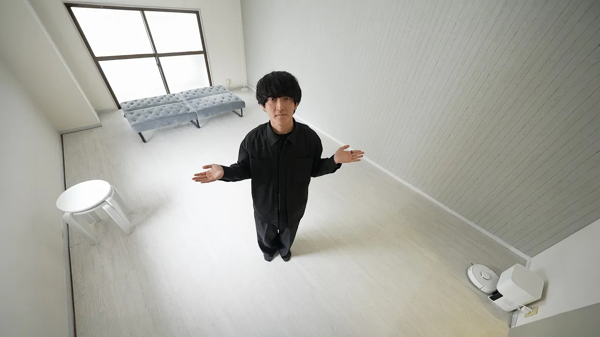{width=75% loading=lazy}
</figure>

https://www.youtube.com/watch?v=XBQBKseozuY

> Extreme minimalist non-nomad

### Exploravore

<figure markdown>
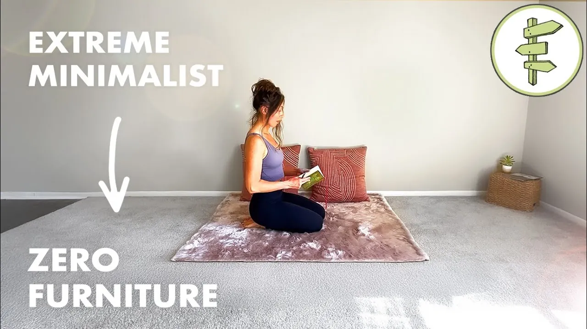{width=75% loading=lazy}
</figure>

https://www.youtube.com/watch?v=6sRUzYVyqjM

> Extreme minimalist semi-nomad

### Rob Greenfield

<figure markdown>
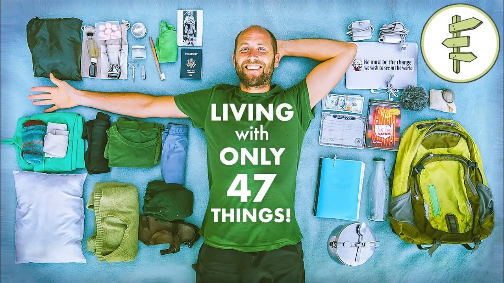{width=75% loading=lazy}
</figure>

https://www.youtube.com/watch?v=3zO3xUg157c

> Extreme minimalist nomad

### Cédric Waldburger

<figure markdown>
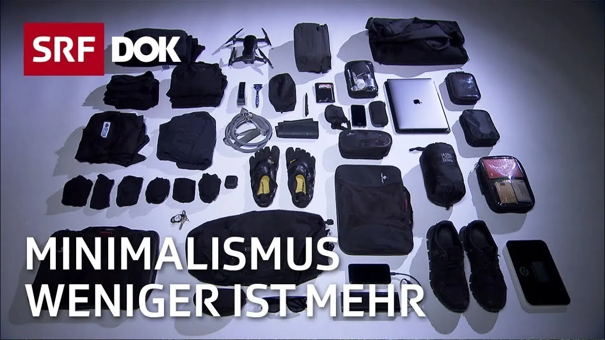{width=75% loading=lazy}
</figure>

https://www.youtube.com/watch?v=QuaxNucYQtg

> Extreme minimalist nomad millionaire
