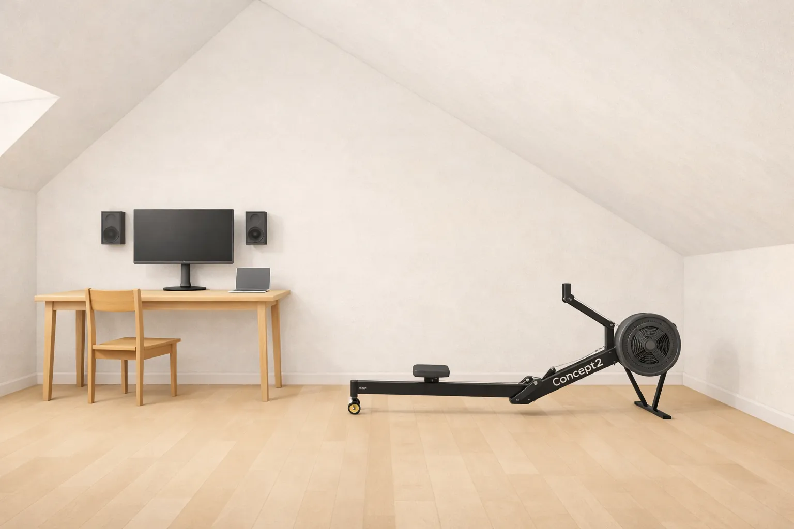

- Main point is not decluttering but improving focus and intention in life
- My journey: from hoarding DIYer down to 2 spoons in the drawer
- Benefits and caveats: e.g. new apartment without moving but also psychological impact
- Practical methods and mindsets: from the box method(s) to future self

<!--more-->

---

# Minimalism

<!---->
<!---->

---

# "/**P**iː **K**eɪ/"

- **Tech Mgmt** with **QA** focus.
- **Maker** and **Board Gamer**.
- Researching and educating about
 **cooking, health, self-improvement**.

--- 

# **What** is Minimalism?

---

# Have only what is **essential for your target identity** to live with **more purpose, freedom, and force.**

<!-- Jogging is not more minimalist than skiing -->
---

## What it's **not**

- **A one-time** purge.
- Owning **as little as possible** for its own sake.
- **Organisation**: optimising clutter.
- **Frugality**: spend less.
- **Deprivation**: do without.

<!-- Minimalism will rather amplify -->
---

## **Why** It Matters

- Modern life wants us to **consume** and overloads us with products, trends and experiences to try.
  - This costs **time, money, and focus for things that matter to you** - up front and ongoing.
  - For example, through **storage, maintenance, cleaning, clutter, organisation, decisions, guilt...**

<!-- 
- Many people spent 2h to "save 2€"
- Guitar not played costs focus
-->
---

## Core Principles

- **Essential** and **enough.**
- **Space as value.**
- **Quality** over quantity.
- **Future** over past self.

---

# My Story

---

## Trigger: **2010-2017**

- First larger hobby budget for **electronics and DIY projects.**
- More tools, parts, and know-how felt like **independence and control.**

<!-- I don't regret the experience, but I lost freedom and control -->
---

## Trigger: **2018-2023**

- Boxes were overflowing - **sorting new things into old clutter got hard.**
- Keeping everything usable felt like it cost **1-2h every weekend** in organisation and maintenance.

<!-- Visitors gasped at the sight -->
---

---

## Trigger: **2024**

- Cellar flooding **destroyed** a lot of **"might still need it later" stock**.
- The cleanup **felt like wasted time** before things could be replaced.

---

# In the end, **none of it had to be replaced.**

 

---

# ~~In the end, none of it had to be replaced.~~

Freeing up a **whole small room.**

---

# ~~In the end, none of it had to be replaced.~~

Freeing up a **whole small room.**

So what if **I kept going?**

---

# The Purge.

---

## Process: ***"Identity decluttering"***

Decluttering e.g. via KonMari "Does it bring joy?" helped me **understand how I felt about the activities behind things** and thus in return declutter my identity.

<!-- Art stuff: maybe it was a phase -->
---

## Process: **Iterations**

Needed multiple passes through all things while **letting a new baseline settle** and **putting things on trial in boxes.**

---

## Process: **Exhausting**

Especially sentimental items left me ***mentally beat*, depressed and indecisive** for the day after only 2-3h.
~~(psychology: loss aversion)~~

<!-- Decluttering childhood items felt like loosing a limb -->
---

## Process: **Addictive**

With every trash bag closed up, **letting go became easier** and **satisfaction about optimization grew.**

---

## Process: **Mistakes**

Needed to **replace ~50 EUR**, some items even days after tossing them - still **gained valuable insights.**

---

# Outcomes

---

## Outcomes: **Space**

- **No need for larger flat**
- More freedom to **reserve space for habits.**

---

## Outcomes: ***stronger* life**

- Feeling more **alive and in control** by spending more time with **intent, purpose and together with loved ones.**
- Increase **hapiness / reduced greed and envy** through clearer **identity, what's enough and understanding hidden costs.**

---

# How to Practice It

---

## Identity: *What you want to do?*

Open up to a new **target self first.**
Not through what you already have but:
- **Hobbies**
- **Habits**
- **Profession**
- **Relationships**

This takes **time, exploration, and iteration.**

---

## Decluttering: **General**

- Declutter by **type** (e.g. all kids toys), not by area.
- **Touch things only once**, and sort into: **toss, donate(5-20€)/sell (>20€), keep/trial.**
- **Prevent 2nd guesses**: things need to leave quickly and often.

---

## Decluttering: **Filters**

- Would you **clean it if filthy/buy it again?**
- ~~Not: "Why can this go?",~~ but: **"Why should this stay?"**
- ~~Not: "When could I need it?"~~, but: **"When did I last use it?**
- **Does it have a place** you would intuitively look for it? Would you **remember having it when needed?**
- **Does it bring joy?**

---

## Decluttering: **Box Method**

- **Empty the container first** and put **back only what deserves** to stay.
- **If unsure**: store it **out of sight in the box.**
→ Let go if still there after 6 months, or 12 for seasonal items.

---

## Decluttering: ***Radical Reset***

Put everything away and bring only back what you need.
 
~~@SamuraiMatcha ->~~

---

## Decluttering: **Easy to hard categories**

**Learn** to declutter in **easy categories first**.

### **Easy**: Clothes, Documents...

### **Medium**: Electronics, Tools, Household...

### **Hard**: Hobby equipment, Sentimental items & decoration...

---

### Category: **Clothes**

- Anything not worn in **1 year**, **wrong size**, or **not target size.**
- If not **at least 90% as good as your favorite version.**
- **1-in-1-out** is essential here!

---

### Category: **Tools, Gadgets, Parts etc.**

- Put in box and **only bring back if really needed.**
- Restriction fosters **creativity to use existing things** for more use cases.

---

### Category: **Digital**

- **Fewer files, accounts, subscriptions, etc.**

**Lockouts**: Automate discipline.
- **Router/browser filters** for social media, etc.
- Bedtime: turn **router Wi-Fi** off & use **desktop shutdown/mobile lockout.**

---

### Category: **Decoration and Sentimental Items**

- Decoration: give yourself **2-8weeks to appreciate the gained space** and let "loss of cosiness" fade away.
- Sentimental: take a photo and then put the thing away. After 1 year, **check if the photo is enough.**

---

## Minimalist **Buying**: keeping it clean

- **Delay purchases**: wishlist first, wait a few days/weeks.
- Buying **solutions to problems, e.g. what annoys you daily**, makes you a lot happier than buying *"new possibilities"* etc.
- **1-in-1-out** (similar item!) prevents future clutter.
- Try a **no-buy-month**: learn satisfaction and creative alternatives

---

# References and Influences

---

## Marie Kondo

https://www.youtube.com/watch?v=FipZIrwtADg
> "Does it bring joy?"

---

## Matt D'Avella

https://www.youtube.com/watch?v=tG2GJZcBKOE
> "What about things that bring you joy?" - "I got rid of that as well."

---

## Joseph DeChangeman

https://www.youtube.com/watch?v=boYThAjUmsk
> Real talk on the emotional impact of going minimalist as a former hoarder

---

## Samurai Matcha

https://www.youtube.com/watch?v=0yiheVIx-X4
> 1 item per day for 30 days challenge: fastest possible path to extreme minimalism and appreciation of what one owns

---

## sibu

https://www.youtube.com/watch?v=XBQBKseozuY
> Extreme minimalist non-nomad

---

## Exploravore

https://www.youtube.com/watch?v=6sRUzYVyqjM
> Extreme minimalist semi-nomad

---

## Rob Greenfield

https://www.youtube.com/watch?v=3zO3xUg157c
> Extreme minimalist nomad

---

## Cédric Waldburger

https://www.youtube.com/watch?v=QuaxNucYQtg
> Extreme minimalist nomad millionaire

---