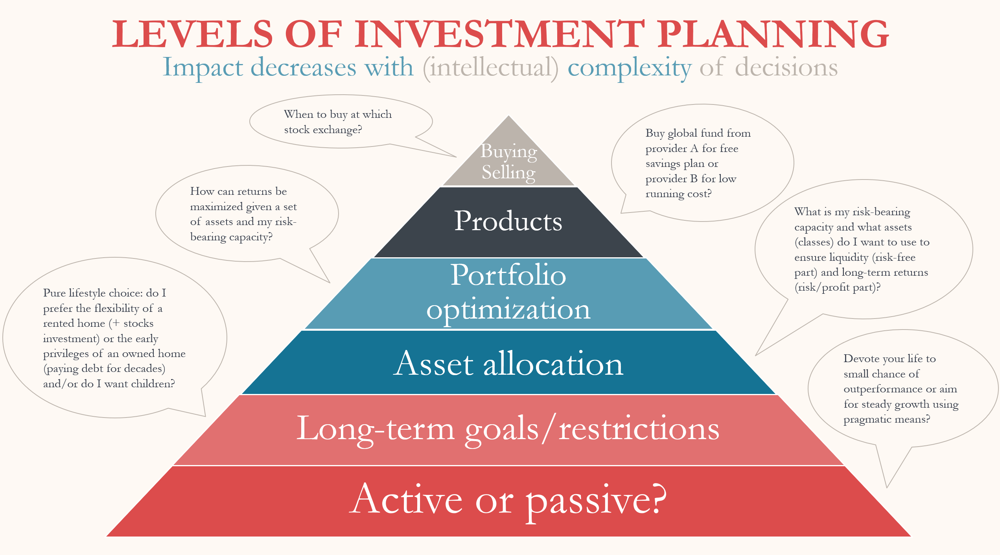
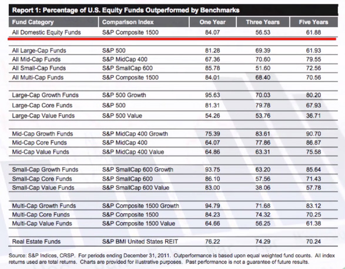
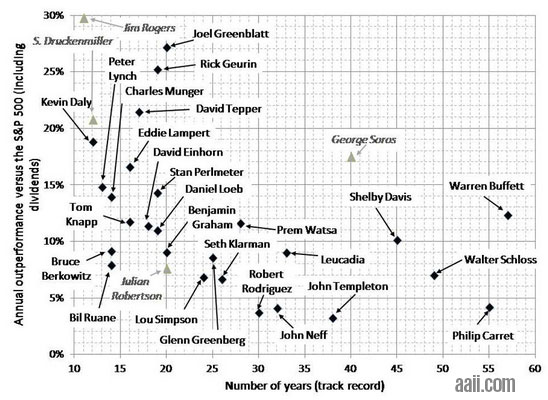
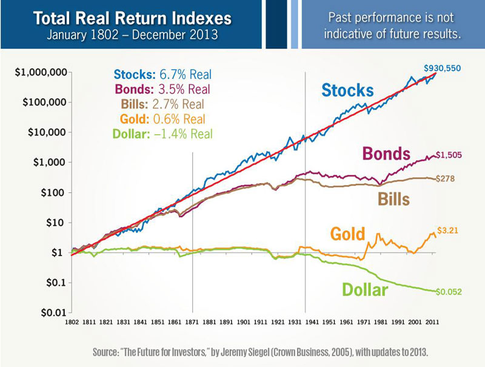

{: loading=lazy}

TODO images phil copyright

> A theoretical and practical guide for pragmatic, rational investor – scientific and forecast-free

* Not investing years into financial education and many hours operation effort every week
* Pragmatic and rational by maximizing risk adjusted, expected returns
* Growing wealth steadily but never winning big
* Believe: not fundamentally less capitalism in the future

<!--more-->

Main source: [Souverän investieren](https://www.amazon.de/Souver%C3%A4n-investieren-Indexfonds-ETFs-Book/dp/3593508524) from [Gerd Kommer](https://gerd-kommer.de/)

https://stocksoftresearch.com/12-charts-for-investing/

## Theory

### Terms

- "**Real returns**": are inflation-adjusted (excl. inflation, thus lower), while "nominal returns" don't consider inflation
- "**The Market**":
  - Stocks offer ~7% real returns long-term (~10% nominal, 40% returns are dividends)

### Active vs Passive Investing

- "**Active**": trying to beat the market with more knowledge and skill than others
    - Methods: market timing + stock picking
    - Assumption: market is not efficient and thus can be outperformed
    - Effort/labor cost: full-time job (given thinking one can have higher skill than educated full-time corporate finance experts only spending few hours a week is foolish)
    - Risk: wrong timing/stocks
- "**Passive**: capture market returns with minimal costs and mistakes
    - Methods: cost-efficient, diversified ETFs 
    - Assumption: market is efficient, but rising, which can be captured long-term with high real positive returns
    - Effort/labor cost: few minutes per month
    - Risk: misjudgment of risk-bearing capacity, living at the wrong time

- Active doesn't work however:
    - Thousands of statistic show that even full-time active investing experts fail to consistently outperform the market
    
    - On top, actively managed funds charge a lot for that
    - Don't be fooled by survivorship bias - over many years and millions of humans, some will succeed by chance. The point is that success can't be predicted and thus reliably reproduced
    

!!! info "Fear of low returns"

    Many active investing salespeople will work with only the half truth and create fear by pointing out that passive investing is not guaranteed to yield positive returns even over a long period of time - that's entirely true and that risk is exactly the reason why there's returns (as risk compensation) in the first place. The other half of the truth however is that looking at estimated returns it's still the best investing method (also yielding higher returns given this risk compared to bank interest investments), while active investing yields the same estimated returns at best (due to the human factor having a negative effect on estimated returns) while active investing also comes with hefty additional cost in the form of management fees or your invested time

## Passive vs Real Estate

- For many, the real choice is between:
  - Living with rent and passively investing the difference compared to big upfront investment and high monthly payments for real estate
  - Buying and living in real estate as main investment
  - Renters will build more wealth early on, while real estate owners overtake them long-term as rent is lost money in the end
  - Financially, considering uncertainty a long time into the future, they are about equal assuming a normal life-span, so it should be a life-style choice. While rent may be lost money, the ability to invest more early really matters while the cost of buying & selling real estate, maintaining it as well as e.g. real returns from raising property prices are often severely misjudged

## Investing decision pyramid

- basic assumptions
- real returns
- active vs passive
  - active doesnt work: survurvor ship bias
  - prediction doesn't work "what can be predicted already exists"
- passive vs real estate: many underestimate buying/selling cost, maintenance, real price increases
- the market
- etfs
- indices & msci world
- theory necessary to stay rational "how you behave is more important than how the market behaves"
- everyone is "playing the game" (risk of safe investment) + demographic change
- modern portfolio theory
- efficient market theory 
- regression to mean
- diversification
  - ice cream/umbrella business
- risk stays: getting a bad wave
- EFT choice:
  - low price (vs active funds)
  - start early with everything: "Time in the markets beats timing the market“

## Assets

- can make sense for diversification, but bonds best for safety and stocks best for profit
- diversification works best if assets not to similar -> loosing returns
- asset classes?
- invest in pure assets forms

## Safety

- stocks have special protection
- state has limited influence on stocks
- play the riches game

## optimization

- Markowitz model
- tuning: returns scale bad for cash and bonds
- Cap vs GDP Weighting
- tax deferral 
- factor investing: decomposing market gains. new concept, up to you

## building a portfolio

- Global portfolio approach
- 0: debt + emergency savings
- 1: risk tolerance
- examples: 100% acwi , 70/30, 50/30/20

## starting

- reading etf names
- etf choice
- broker
- buying
- rebalancing

## advice summary

## working summary