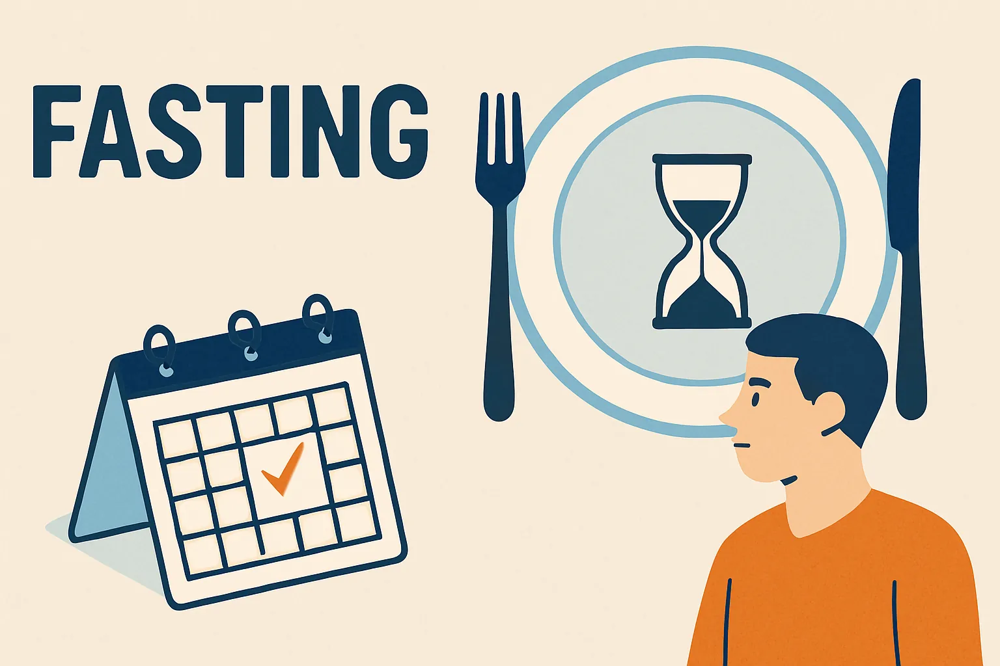

- I did near zero calories fasting for 8 days - here's what happened

<!--more-->

---

## Motivation
- **Fatty liver**: simple calories deficit doesn't help - deep ketosis e.g. through fasting necessary [^fattyliver]
- Experience how **deep ketosis & autophagy** feel
- Reset salt, sweetness, insulin and food volume **desensitization**
- Get a bit **leaner**

## The plan

### Prep

#### Digestion / Detox
- **Laxative**: Glauber salt (~5€ at the pharmacy) for a "clean" fasting start and stomach pain prevention
- **Tea**
  - Dandelion "Löwenzahn"
  - Nettle "Brenessel"
- Apple **vinegar**: mild, low in calories and inhibits insulin spike

#### Supplements
- **Vitamins**: [^vitamins]
- **Electrolytes**, especially Magnesium & Potassium "Kalium" [^electrolytes]

#### "Food"
- **Tea**
- **Soup veggies**, e.g. 400g / 2 days
- Veggie **broth**
- **Erythritol and stevia**: two of the few zero calories sugar substitutes that don't lead to insulin spikes and are not known to impact gut health and thus e.g. insulin resistance [^fattyliver]

#### Equipment
  - **Hot water bottle / grain pillow** etc.: to calm the stomach and feeling cold due to low energy and bad sleep
  - Optional **tracking**
    - Body **scale**
    - Body fat **caliper**
    - **Heart rate** monitor (e.g. watch, to enable monitoring during sleep)
    - **Blood pressure** monitor
    - Continuous **glucose** monitor [^cgm]

[^vitamins]: E.g. https://www.dm.de/mivolis-vegetarier-und-veganer-vitamine-mineralstoffe-tabletten-30-st-p4066447336986.html
[^electrolytes]: E.g. https://www.dm.de/mivolis-elektrolyte-20-sticks-p4066447788426.html
[^fattyliver]: https://www.l-iz.de/bildung/forschung/2020/02/interview-peter-schwarz-iss-so-viel-du-willst-aber-beweg-dich-noch-mehr-317267
[^cgm]: E.g. https://www.freestylelibre.de/produkte/freestyle-libre-3-sensor.html

### Daily routine

+ **2-4L Water**
  + **Veggie soup** (lasts for 2 days actually)
    + Boil 400g veggies in 1L for 40-60min
    + Strain liquid from veggies
    + Add as little salt as possible, up to 6g
    + Compensate evaporated water up to 2l again
  + **Teas**
    + 1x bag Dandelion + 1x Nettle per day to support detox
+ **Supplements**
  + Intake according to product recommendation
+ **Training**
  + Strength training to prevent muscle loss
  + At least 4k steps to support digestion and counter metabolic adaption

### To avoid
- Portions with **calories >10-20kcal**
  - Will not only **inhibit autophagy & ketosis**, but can also lead to insulin spike and thus hunger
- **Protein**, as it might inhibit ketosis
- Any food with **intense flavor**, e.g. also coffee - not needed for the fat-reduction or detox related benefits, but would reduce the desensitization benefits and might lead to other issues like cravings or drinking more than necessary to experience flavor
- **Too much salt**, as it increases thirst and thus further promotes electrolytes loss

### Timeline

#### 2 weeks before
- Get used to **eating less**, e.g. 100-250 kcal daily deficit
- Order **prep stuff**

#### 1 week before
- Reduce calories down to **500-1000 kcal till last day** before fasting start
- **Not much fiber** the day before, e.g. only curd, yoghurt etc.

#### Day 1
- **Glaubersalz** 30-40g 500ml in 15min
  - to ensure there's nothing left to digest in the stomach and prevent discomfort or cramps, as without new food to push, old food is kind of stuck
- **Cardio** to exhaust carbs

#### Day 2-4
- Timing: ideally on a **weekend**
- Prioritize **strength training**, cause risk of muscle loss with no food and without ketosis is the highest here
- Prepare for **"fasting crisis"**
  - **Hunger** might be high, **mood** and **concentration** especially bad
  - Increases **risk of pain** due to adaption to ketosis and e.g. release of bound toxins in fat tissue

#### Day 5
- **Vacation** day for rest

#### Day 7-10
- Prepare for **ending the fasting** based on personal goals and how fasting that long feels

## My actual experience

### Energy/Endurance

> - How easy it was to exercise or even move (motivation wise)
> - Low energy levels make prolonged cardio in particular very hard and lead to higher heart rate at same output
> - Low energy doesn't mean potential strength output is low, but it get's very uncomfortable and requires a lot of discipline
> - Low energy levels are maybe the main factor that make fasting feel hard to endure, especially if you need to stay productive and active

- Personally the hardest part for me about fasting was knowing that skipping strength training would mean sacrificing hard earned muscle at a potentially fast rate and thus needing to find the **motivation for daily training as much as before - while fighting against increasing discomfort** to finish sets strong and later even starting sets at all
- When energy hit a new low on **day 8 and going shopping felt like hiking uphill**, I decided that considering needed buffer/ramp up for recovery I should rather **start eating again to be fit for work next week**
  - same as the days before, after ~10-30min of walking/activity: energy levels actually recovered noticeable and the activity didn't feel so uncomfortable anymore after building some momentum
  - this again showed that activity wasn't impossible, but rather the **body just "strongly discouraged" activity to conserve energy**
- Even after eating normally again, especially during training (gymnastics) I noticed energy wasn't back to the levels before
- Energy preservation was also noticeable through indoor **temperature feeling 2-5°C lower** and warmer clothes didn't help so much as cranking the heating up

### Power/strength output

> - Maximum strength set volume output during strength training compared to before
> - Lower power levels mean maximum set volume was lower even at maximum discipline 

- As expected, **maximum set volume almost didn't suffer at all** except maybe on the worst days and during exercises with more pronounced endurance component (e.g. L-sits)
- On day 11 I even set a new personal record, increasing my handstand-against-wall time from 180 to 240 seconds

### Dizzy

> - Dizziness while standing but also sitting as well as "brain fog"
> - Inhibited mental work similarly as low motivation

- The dizziness was **comparable** to what I feel during a **fever**
- Especially combined with mental fatigue in the late afternoon this was **impacting concentration required for mental work**
- **Balance** during exercise **wasn't impacted** noticeably
- Luckily the dizziness **mostly came only in short spikes** and I barely noticed them longer than 30min at a time

### Mood

> - General mood, e.g. considering feelings of sadness and irritability

- More than anything, mood seemed **mostly related to cravings** and e.g. not being able to do cooking as a hobby

### Motivation

> - Motivation to be productive and active
> - Low motivation will lead to e.g. excessive doom scrolling and make non-intrinsically motivated (mental) work quite hard to keep up

- I really **needed day 5 as a vacation day to recover some motivation** - not sure I'd have managed without it and not appearing like a slacker at work

### Hunger

> - Feeling of hunger as in actually needing to eat, as e.g. indicated by stomach growling

- As expected, probably **keeping insulin very low** at all times by staying at almost zero with calories helped with keeping **hunger in check** so that it was only a minor inconvenience - pretty unimportant e.g. compared to lower energy levels

### Craving

> - Simply "wanting to eat" or tasting something flavorful independent of a feeling of needing to eat

- Here I really **failed the idea of fasting to avoid intense flavors**, especially sweetness and salt
- On day 2 I began to use more erythritol and stevia tabs e.g. in my tea, where I think especially the erythritol but maybe also the carriers ingredients in the stevia tabs lead to regular bubbling in my stomach, though e.g. not uncontrolled diarrhea or gassing
- On day 4 I bought some artificially sweetened lozenges
- On day 5 I switched out some tee with heavily diluted (20 kCal) DIY hot chocolate
- On day 6 I **increased the sweetened consumption** yet again, **making it hard to fall and stay asleep**
- Before going into calory surplus on day 11, I still felt **strong cravings** at intake levels that should have been around maintenance level (and I didn't feel hungry)

### Pain

> - Any kind of kind which seems directly related to fasting
> - Starting the fast with a laxative is recommended to prevent fasting pains
> - Stomach (region) pain is probably most common (as it was more me), but e.g. muscle aching due to limited regeneration could also be considered here
> - This excludes e.g. non-painful bubbling in stomach

- I felt both **pain spikes (day 3 + 6) from somewhere in lower liver region**
- They were sharp enough to prevent me walking with a straight spine - - The 1st spike I could **remedy by laying down** for 3min, which seemed to get some water out of a spot where it didn't belong especially during sitting it seemed
- The 2nd one was even sharper but went away quickly after a toilet break and without needing to lay down
- Interestingly, **binging 1600 kCal at day 8 6pm in 3-4h only caused me only minor issues**. I started off again with a veggie puree made of veggie soup liquid remains and frozen veggie soup "leftovers", which caused a minor and short discomfort in the stomach. After that my stomach didn't complain much, though I also tried to keep volume in check with higher calory food like soy bean flakes

### Sleep quality

> - Perceived sleep quality of that night going into the next morning

- Beyond the first days where hunger was still noticeable, **sleep quality later mainly deteriorated due to increased consumption of sweetened drinks**
- but also late night walks I tried to cram in before sleep to counteract not moving enough during the day

### Sleepy

> - Feeling of sleepiness, without differentiation whether caused by low energy levels or poor sleep quality

- Unsurprisingly, sleepiness increased with decreasing **sleep quality** and I feel this was the **main factor here, even considering decreasing energy levels**

### Weight

> - Measured after getting up, going to the toilet, in underwear only
> - Weight differences should always be evaluated carefully and rather averaged across no less than a week, e.g. considering that muscles in the average person can store ~2kg of water and drinking 2-4l daily during fasting is recommended
> - Rather, consider that 1kg of body-fat can provide 7000 kCal, so assuming e.g. a 1500 kCal deficit should result ~200g fat loss per day
> - Anything beyond that must largely be water based differences to happen so quickly

- Kind of in line with expectations, considering the bodies energy savings attempts maybe reducing my base metabolic rate from ~1600 to maybe below ~1300 or lower, **final weight loss was about 1kg** - 1.5kg
- My body fat measured via caliper in the suprailiac area went from 6.5mm to 5.5mm (day 8)

### Resting heart rate

> - Measured by Huawei Watch Fit 3

- The **very low RHRs** were usually measured **during sleep** of course
- It **didn't really give me distinct feeling** as far as I could tell - much unlike low blood pressure strongly correlating with dizziness for example

### Calories intake

> - Total kCal intake, incl. e.g. supplements

- Due to **cravings** I also starting adding diluted hot chocolate to the menu from day 5 (on top of ~20kCal from supplements)
  - How much those **calories and potentially insulin lead to the sharp breakdown of energy** and e.g. blood pressure levels would be **interesting to know**
- After eating again normally on day 8 - 10, I wanted to set a signal of "there's enough food, provide energy please" to my body (and also address constant cravings honestly) on day 11, so I went into a distinct calory surplus

### Water intake

> - Rather accurate during fasting, else estimated intake through raw liquids + food water content

- **Due to cravings**, I consumed **more** sweetened tea and hot chocolate **from day 6**
- by day 5 it felt like individual drinks passing through the body in 30 - 120min tops

### Blood pressure

> - Measured by Omron RS7 Intelli IT
> - Sys on top, Dia below

- Even though I exercise a lot, I guess due to low body weight **my blood pressure is generally low**, giving me not a lot of buffer before other circumstances that lower pressure even further lead noticeable dizziness
- Blood pressure seemed **fine though until I started to get short black outs on day 7 and then especially day 8** when trying to stand up from sitting too quickly. I didn't want to get to a place were there was a risk of collapsing while standing, so I took this as a **sign to quit the fasting**

### Stress / HRV

> - Proxy of heart rate variability
> - Measured by Huawei Watch Fit 3

- **Doesn't tell me much**, other than it seemed to decrease during fasting and then increased again

## Learnings

- Potentially went into an **electrolyte deficit** due to reading the label wrong
  - the supplement only provided 15% of recommended daily Potassium and 40% Magnesium
  - on the one hand I took at least 10g of added salt per day and the daily 1L of veggie soup is also intended provide electrolytes
  - on the other hand on the later days the 4L of liquid intake also lead to constant liquid and electrolyte on the toilet
- **Didn't feel any "fasting high"** or sign of increased serotonin levels - or it didn't unfold due to my lack of control of cravings
- This is also connected to maybe the **most interesting open question: how much did giving in to cravings** later e.g. via hot chocolate **"ruin" the later phases of fasting** by disturbing ketosis?
- Fasting could be an **interesting alternative to the classical** e.g. 1000kcal deficit **mini-cut**, as science suggests that only the first days without food and out of ketosis are really harmful for muscle mass. My **strength performance even during fasting barely decreased**, maybe even rather increased a bit (of course less weight needs to be lifted for bodyweight exercises), suggesting that ketosis/fasting at least no longer than maybe 10 days isn't harmful here, but the **weight/fat loss is definitely there**
  - Thus I also wouldn't recommend e.g. eating 250g lean curd per day as some recommend - the 30g of protein aren't a lot given the deficit and I guess potentially disturbing ketosis would do more harm than good in this regard
- Considering very low levels of hunger, even without direct comparison **I'd recommend a near "zero diet" with supplements over classical Buchinger fasting with fruit/veggie juice for lunch**, as I don't think this would have helped with the cravings, but likely would maybe have rather increased them or added hunger to the mix via increased insulin
- As somebody who exercises weight control through high volume meals, **feeling more full and satisfied even with smaller meals was noticeable and an unexpected benefit**
- Unsurprisingly, due to giving into salt and sweetness cravings, the customary fasting break apple wasn't so much more exciting flavor-wise, though eating some solid was nice

## Postscript

Man, I really not only missed the flavors from eating but maybe even more **not being able to meaningfully have fun with cooking**. I spent the next 1-2 weeks cooking and baking all sorts of old and new dishes, though starting of course with one of my favorites: Teriyaki chicken salad wrap. Just leaving it here...

