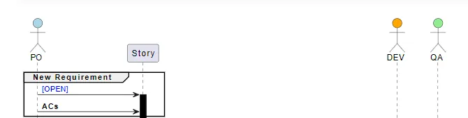
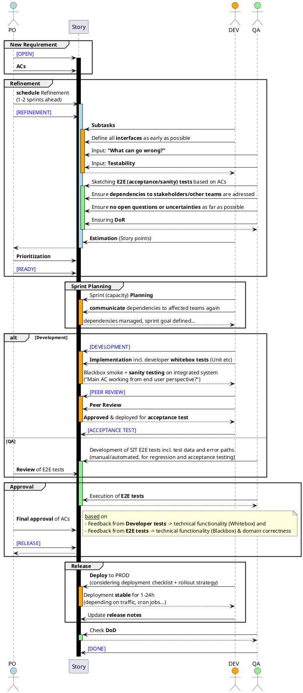

- Example of high level **3 Amigos** (Business, Development, QA) **story lifecycle** process

<!--more-->

---

!!! info

    **Business "PO"**, **Development "DEV"** and **Quality Assurance "QA"** should be understood as **roles**, not necessarily different persons at all times. E.g. if a QA specialist is unavailable, a DEV can also focus on the QA perspective during refinements.

