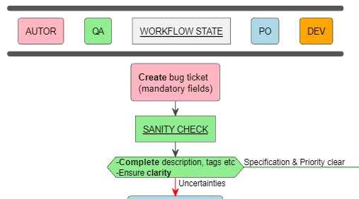
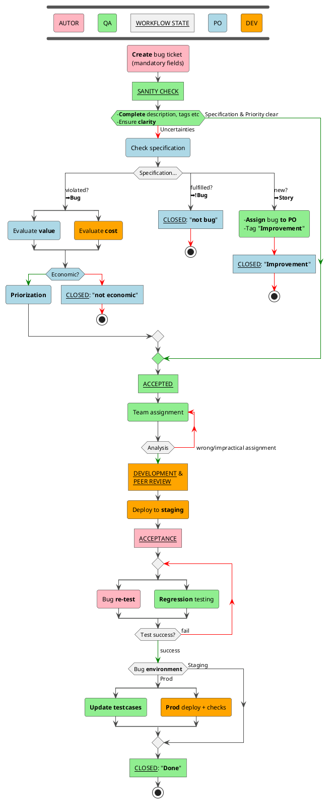

- Example of **bug process** with actors AUTOR, QA, PO, DEV and states (e.g. for workflow in Jira)

<!--more-->

---

!!! info

    **Business "PO"**, **Development "DEV"** and **Quality Assurance "QA"** should be understood as **roles**, not necessarily different persons at all times.

