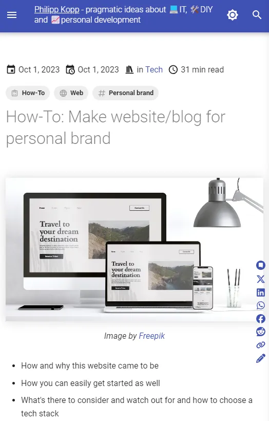
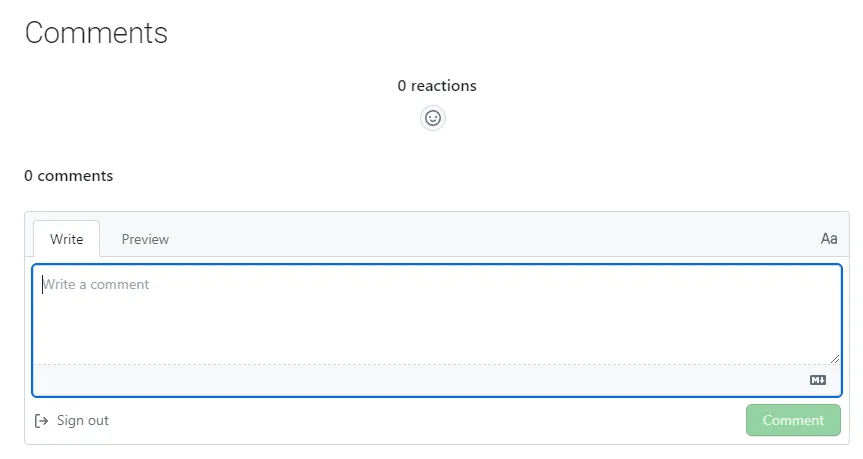

<figure markdown>
  {: loading=lazy}
  <figcaption>Image by <a href="https://www.freepik.com/">Freepik</a></figcaption>
</figure>

- Quick steps to get your website up - quick and cheap, yet professional and legally sound
- Details on all technical options and legal considerations
- Tips for continuous efficient content creation by leveraging your existing knowledge

<!--more-->

## Recommended first steps

1. [Choose a Markdown/document-focused static site generator](#static-site-generators-ssg) ("SSG") or rather [theme](#themes--plugins) you like best -> easy setup/maintenance, focus on content
1. [Buy a domain](#custom-domain--email--ssl) incl. email account, enable SSL -> professional appearance
1. Register domains in [Google Search Console](https://search.google.com/search-console) (not with your private Google account)
1. [Generate privacy policy, imprint, license](#minimum-for-own-website) and set up cookie consent
1. Invest in a nice "[About](#about-page)" page and possibilities to reach you (e.g. contact form, social links) -> an important part of *personal* brands is your face, a sympathetic introduction and approachability
1. Create [GitHub repo, install SSG](#githubgitlab-pages-static-sites-only), config, deploy via GitHub Pages/Netlify -> free and solid hosting, easy Giscus commenting integration
1. Write your first article and establish your article style
1. Also post your first article on Medium + LinkedIn (using the canonical link of your post) for increased exposure

## Why build a personal brand via your site

- **Showcase expertise**
    - Articles on your site allow you to demonstrate your expertise and knowledge in a specific field or industry. By consistently publishing high-quality, informative content, you can **establish yourself as an authority in your niche**. Regularly sharing valuable insights, experiences, and opinions can help **build trust and credibility** with your audience.
    - Your site can serve as a **dynamic portfolio of your work, achievements, and thought leadership**. This is particularly valuable if you're in a creative or knowledge-heavy profession.
- **Networking**
    - You can connect with like-minded individuals, experts, and influencers in your field **through comments and offering opportunities to contact you** via email or links to your social media profiles.
- **Narrative control & value association**
    - Publishing content under your domain, maybe even prominently using your name is a really good method to ensure potential clients/employers etc. **associate your work and the value you create directly and primarily with you or your brand** (vs. e.g. your employer or a platform you create value on).
    - Here you also have **full control** over your narrative and can present whatever you want however you want as well as fully **own your content**
- **Monetization**
    - Though building a solid brand is certainly the more challenging part, having build your brand with your site playing a main role probably makes **monetization via affiliate marketing, sponsored posts, selling digital products, or offering online courses** a lot easier and ensures the brand is further strengthened when those are added to your site.
- **Personal development**
    - **Writing requires you to research, write, and continuously learn**. It can be a platform for personal growth and skill development. Through comments and social sharing, you can engage with your audience and **receive feedback on your ideas and content**, which can help you refine your personal brand.

## Tech considerations

### Publishing frameworks

<figure markdown>
  {: loading=lazy}
  <figcaption>jamstack.org/generators</a></figcaption>
</figure>

#### Static site generators (SSG)

- **Typical minimal setup**
    - Create repo
    - Choose a [theme](#themes--plugins) for your needs (landing page, blog, image portfolio...)
    - Provide config values
    - Publish e.g. via [GitHub/GitLab](#githubgitlab-pages-static-sites-only)
- **"Static"** premise
    - **Generate HTML from static documents** (e.g. markdown) and/or via templating/frameworks (e.g. React)
    - Thus they **don't require a DB or backend** and code-wise **may contain little more than only the website content itself** (almost "no-code")
    - Usually **SSR**-focused
        - **Fast** even with plugins etc., as compute effort mostly at build time + mostly CDN cacheable (+ some frameworks still over single-page-application behavior)
        - Good for **SEO** as fully rendered pages are delivered
- **Document-focused** frameworks
    - Centered around the idea of **generating navigation and content directly from .md files**
    - For main page content to **update** a **rebuild** is usually necessary
    - Even they can be heavily **extended via underlying language**/web-framework
    - In a sense more/**easier to secure**, as no backend or DB services can be attacked
    - E.g. **proper search** is usually still built-in, e.g. Giscus commenting often as a plugin
- Arguably **more for tech-savvy people**, though themes/document-focused frameworks **can simplify the setup almost down to a few config values**
- **Use your favorite editor with live preview** (or preview with hot-reload dev-server), no need for separate CMS software
- **Typically free** software

<br>

- [Markdown-document-focused (⭐sorted)](https://jamstack.org/generators/)
    - [Hugo](https://gohugo.io/) (Go)
    - [Docusaurus](https://docusaurus.io/) (js + React)
    - [Jekyll](https://jekyllrb.com/) (Ruby + Liquid)
    - [Hexo](https://hexo.io/) (js + etc.)
    - [VuePress](https://vuepress.vuejs.org/) (js + Vue)
    - [Eleventy](https://www.11ty.dev/)  (js + Liquid)
    - [MkDocs "Material"](https://squidfunk.github.io/mkdocs-material/) / [Pelican](https://getpelican.com/) (Python + Jinja)
- [More generic web frameworks (⭐sorted)](https://jamstack.org/generators/)
    - [Next.js](https://nextjs.org/) (js + React)
    - [Gatsby](https://www.gatsbyjs.com/) (js + React)
    - [Nuxt](https://nuxt.com/) (js + Vue)
    - [Astro](https://astro.build/) (js + React/Vue...)

!!! info "My decision for MkDocs Material"

    - [**Setup**](https://squidfunk.github.io/mkdocs-material/getting-started/) **couldn't be more simple** the init command leaves you with a config file and a folder to drop Markdown files in that immediate get rendered to pages with header- and side-navigation. The excellent documentation leads you through further customization through plugins, where anything you might want to start with from search, over blogging, commenting and RSS to a cookie consent manager can quickly be set up thanks to sensible defaults.
    - As a document-focused SSG it's **fast, secure, scale, low-maintenance and easily and freely hosted** via GitHub Pages
    - Important for me: it's **Markdown (documentation) focused** in particular, meaning e.g. relative links just work and documents incl. folders can just be copied around even between other (knowledge management) software
    - I particularly like the emphasis on **good navigation** through fast full-text search, sticky side navigation, TOC and even keyboard shortcuts as well as that large **tables** can easily be rendered from CSV or Excel files

#### (Self-)hosted blogging software / CMS / Website builder

  > About half the internet runs on WordPress 🤯 [^internetwordpress]

  [^internetwordpress]: [https://w3techs.com/technologies/overview/content_management](https://w3techs.com/technologies/overview/content_management)

- **Typical minimal setup**
    - Pay for hosting with one click install of your CMS of choice
    - Basic config like site name, admin account... via wizard
- **Not really free**, as hosting on a server or as a service has to be paid. Also, powerful plugins can be quite expensive 
- **Battle-proven solutions** having existed a decade longer, WordPress etc. have vast
    - **Communities and documentation**
    - **Ecosystems of plugins/integrations** for any purpose
- **More accessible UI/WYSIWYG approach** compared to SSGs for non-tech-savvy people
- Careful **optimization** might be **necessary** to keep **performance** high
- **Can be harder to troubleshoot** if breaks "under the hood", as usually no direct control over the software code
- Self-hosted: **harder to secure and maintain** (updates of service software, plugins...) than document-based SSG or publishing platforms

<br>

- **Typical CMS / Website builder**
    - [WordPress](https://wordpress.com/)
    - [Drupal](https://www.drupal.org/)
    - [Ghost](https://ghost.org/)
    - [Joomla](https://www.joomla.de/)
    - [Blogger](https://www.blogger.com/)
    - [HubSpot](https://www.hubspot.com/)
    - [Squarespace](https://de.squarespace.com/)

- **Personal knowledge management with publishing feature**
    - [Notion.so](https://www.notion.so/)
    - [Obsidian.md](https://obsidian.md/)

#### Publishing platform

- The main advantage is a **quick and easy start**
    - **start writing right away** after sign-up, no maintenance, administration etc.
    - **immediate expose** via the vast traffic, which honestly also feels quite motivating for starters
- **May be paywalled**, but thus might also **allow you monetization of your content**
- You **only own your content (legally)**, but have **little to no control** over everything else. Exporting/moving your content might be practically impossible (without dedicated tools) 
- Usually **very limited to no customization/extension**, e.g. forms, newsletters, content beyond text and images... (though e.g. Medium offers using your domain [^mediumdomain])
- **Restricted applicability for personal branding** not ensured that visitors associate your content particularly with you, not the platform (probably less the case on LinkedIn)
- Networking opportunity amongst authors as well as authors and readers

[^mediumdomain]: [https://help.medium.com/hc/en-us/articles/115003053487](https://help.medium.com/hc/en-us/articles/115003053487)

!!! success "Recommendation"

    **Mirror your own blog** on Medium + LinkedIn <br> 
    ([using canonical links!](https://help.medium.com/hc/en-us/articles/214550207-Import-a-post) to mark your blog as the original source for SEO reasons)

- **Examples**
    - [Medium](https://medium.com/) (135M visits/month)
    - [Substack](https://substack.com/) (45M visits/month)
    - [DEV](https://dev.to/) (12.5M visits/month)
    - [HubPages](https://discover.hubpages.com/) (1.5M visits/month)
    - [Vocal](https://vocal.media/) (3M visits/month)
    - [LinkedIn](https://www.linkedin.com/feed/) (1.7B visits/month)

#### Comparison of selected frameworks

{{ read_csv("frameworks.csv") }}

[^jekyllspeed]: [https://oceanumeric.github.io/blog/jekyll-mkdocs-quarto](https://oceanumeric.github.io/blog/jekyll-mkdocs-quarto)
[^blogvsmedium]: [https://www.bloggersgoto.com/medium-vs-own-blog/](https://www.bloggersgoto.com/medium-vs-own-blog/), [https://hulry.com/medium-vs-own-blog/](https://hulry.com/medium-vs-own-blog/)
[^obsidianperf]: [https://obsidian.md/blog/obsidian-publish-now-offers-more-for-less/](https://obsidian.md/blog/obsidian-publish-now-offers-more-for-less/)

#### Themes & Plugins

<figure markdown>
  {: loading=lazy}
  <figcaption>jekylltemplates.com</a></figcaption>
</figure>

- Themes (or sometimes "templates") for SSGs and CMSs usually go beyond styling and can have **a huge impact on the setup experience and out-of-the-box features**
- Particularly with CMSs but also more popular SSG like next.js, **popular themes are paid** (though they thus might also come with additional support)
- A theme is a **central additional dependency**, that
    - **need to be updated**
    - **can e.g. also break your site** from a software perspective
    - **can influence compatibility with other plugins/extensions**
- Might come with a **certain lock-in effect** due to specific features or your customization effort even if the framework isn't changed
- Usually **influences performance** to a greater degree and thus also **SEO**
- Especially with **SSGs** and their more generic nature, in contrast to CMSs, **plugins are more likely to be incompatible** if framework-agnostic  
- A highly popular (and thus e.g. well maintained, documented...) [framework](#publishing-frameworks) with a poor theme selection for your intended purpose (e.g. blogging) might be less preferable than another less popular framework where you already found a theme that you really like
- For basically all frameworks you can **find theme galleries that usually also come with demo sites** you can check out right away (e.g. [Hugo](https://themes.gohugo.io/)). Ideally, they also come with links to the code for the demo site, so you can and should check out if you like the [file structure](#markdown-features--file-structure) 

##### Mobile first



- **Responsive frontend design** is the norm now, but this **doesn't automatically mean mobile first**
- **Try viewing** your framework theme of choice on **mobile** or via desktop browser dev tools and see if e.g. **TOC, social buttons, header, article metadata incl. author info, tags and cookie consent** are still somewhat **usable and e.g. tables don't wildly overflow**

### Basic web setup

#### Hosting for static sites

##### GitHub/Gitlab Pages (static sites only)

- GitHub is more popular
    - Better availability
    - Easier integration of free [Giscus](https://giscus.app/) commenting

Details for [GitHub Pages](https://docs.github.com/en/pages/getting-started-with-github-pages/about-github-pages#limits-on-use-of-github-pages)

- Price: **free**
- **Custom domain** yes
- **Prohibited uses**
    - **Online business**, e.g. webshop or SaaS solution
    - Handling sensitive data, e.g. passwords or transactions
- **Limits: more than enough** for years of personal blog/brand hosting and you'll be contacted rather than charged in case you exceed the limits
    - File: 1GB
    - Repo: 1GB
    - Deployment: 10min
    - Builds: 10/h (soft)
    - Traffic: 100GB/month (soft)
- Privacy
    - IPs are logged

##### Netlify

- Basically GitHub Pages with [**additional features**](https://www.netlify.com/github-pages-vs-netlify/) like e.g. **CDN, rollbacks, asset optimization, form handling, split testing**
- very **similar usage limits** on the **free plan** (but charges you for exceeded limits)
- **direct integration with most SSGs**

#### Custom domain & email & SSL

- Presenting your personal blog/brand on your **domain named after you simply looks more professional** and can also be used even if your content is non-self-hosted (e.g. on Medium [^mediumdomain])
- **Top level domain doesn't matter much** country-specific domains like *.de* only have a **slight local advantage**. Though hosting an international site in English on a *.com* domain isn't wrong either
- If you go for a *.com* domain, you might also be able to get a **cheap bundle offer** (e.g. *.de* + *.com*) for very little additional cost with a domain for your country 
- Afaik [hosting.de](https://www.hosting.de/domains/) provides the cheapest *.de* domains
- The domain should come **with an SSL certificate**, ideally a wildcard certificate extending to subdomains, as encrypting web traffic this way is so expected nowadays that **you'll even rank lower SEO-wise** for not having one even if your site is nearly completely static
  - With GitHub Pages, you can use the [option "Enforce HTTPS"](https://docs.github.com/en/pages/getting-started-with-github-pages/securing-your-github-pages-site-with-https) so that it can fetch a TLS cert from Let's Encrypt automatically if your repo is public
- While receiving emails might be possible via a redirect of emails from your domain to your private **email account, for replying** from your domain you either need an email server or account with your hoster - best just get it **in a bundle with the domain**
- If you are comfortable to commit (after 1-year discount), **getting a domain for** the next 10 **years in advance comes at a good discount** e.g. at [namecheap.com](https://www.namecheap.com/)

#### Backend or not

Having an SSG solution with **no backend and DB is totally possible, scalable, reduces cost, maintenance effort and security attack vectors** while **realizing user interaction** e.g. forms is still easily **possible via 3rd-party providers**

##### Security and Scalability

- Without backend/DB
    - You can't easily run out of compute power or run into latency issues, especially since SSG sites can almost be fully cached, so **hosting stays cheap, scaling is easy and no DDoS** attacks to fear about
    - No public endpoint attacks, network intrusion, SQL injection, user credentials to protect or usual dependency vulnerabilities to worry about since code is only responsible for generating your static side and doesn't run after the initial build
    - So especially with document-based SSGs, to **only way to get hacked and be solely responsible for it is to have compromised login credentials to your hoster or 3rd-party services** and then data being extracted or e.g. malicious scripts directly being committed to your repo
- **3rd-party** replacement **solutions** come with **privacy issues and possibly suboptimal UX** however especially on the free tiers as they won't usually be 100% aligned with the existing UX experience on your site (e.g. need to login to comment).

##### Forms

<figure markdown>
  {: loading=lazy}
  <figcaption>formspree.io</figcaption>
</figure>

- Even a blog, without e.g. a webshop or other dynamic web service, one can still make good use of **forms** in various ways, mostly to better engage with your readers
    - A **generic contact form** pretty much always makes sense and might even be [legally required](#imprint-privacy-policy--cookie-consent)
    - Email sign-up for a **newsletter** is the next most popular tool
    - The **commenting** experience for users is nicer if **no login** like with Giscus or Disqus is required because the comment is handled by your own backend
    - **Polls/surveys** can yield better insights than pure quantitative analytics
    - **Contests and giveaways** can be interesting if your niche is related to physical products
    - **Guest posts and local community event/meetup registration** can be interesting if a certain site traffic/size is reached 
- Apart from direct contact and maybe contests/giveaways, many **more specific use cases go beyond simple form submission but also require handling associated processes** (e.g. newsletter -> delivery, surveys -> evaluation, comments -> moderation) - that's why you may find highly **specialized 3rd-party providers** in those areas
    - Thus it might seem practical to decide on a setup with backend and DB to avoid an extensive privacy policy by going for a DIY approach and e.g. managing a newsletter feature yourself, however in the **future more sophisticated solutions would require serious dev work and expertise** or at the very least a lot of manual work to handle e.g. hundreds of newsletter subscriptions yourself - not to mention the effort to make sure all user data is secure
    - In the end, using a backend and forms to handle user data yourself **only makes sense if plugins for your framework exist, that handle everything on your server** without 3rd-party service even in the middle
    - Such plugins are **almost non-existent for SSGs** it seems however 
    - **With CMSs they do exist**, e.g. for WordPress you could use free [MailPoet Plugin](https://www.mailpoet.com/) or [The Newsletter Plugin](https://www.thenewsletterplugin.com/) instead of [Mailchimp](https://mailchimp.com/) to manage newsletters. And since newsletters, commenting, polls etc. all don't typically require real-time performance, such plugins could probably also run with greater userbases on typical blog hosting infrastructure 

### Collaboration & User interaction

#### Author collaboration

- Is probably not a huge concern for a website aimed at personal branding
- Via Git for SSGs and multi-user-management in CMSs **usually also possible at least asynchronicity**
  
#### Commenting / User collaboration



- Good idea from a **core reader engagement** point of view
- **Without backend**
    - **Content** often solved via "**edit this page**" links that lead to the **page source on GitHub**, where users can propose changes via the established PR request process
    - For **commenting**    
        - The popular [Disqus](https://disqus.com/) sadly comes with additional privacy protection baggage, a Disqus or Facebook/Google/Twitter login as well as ads in the free version
        - [Giscus](https://giscus.app/) is the most popular **cost and ad-free** solution and also **easy to integrate** (especially if the site repo is also on GitHub) via a **simple script snippet**, though requires and only works with a GitHub login (which might be a non-issue for a technical audience)
- SSG sites **with backend or CMS** might even offer plugins for e.g. line specific user commenting

#### Analytics

- **Getting feedback from users e.g. via comments is usually quite rare for blogs** compared to total user volumes or e.g. shopping sites. Thus, if you want to tweak your content to your audience to a greater degree, **collecting** some sort of **usage data** is often quite helpful
- [**Google Analytics**](https://analytics.google.com/) is the **de facto standard** for website analytics, **free** and thus pretty much **well supported** in any [framework](#publishing-frameworks)
- Other popular options like [Matomo](https://matomo.org/) often aren't free
- [Amplitude](https://amplitude.com/)'s free plan seems usable
- **Integration** is often achieved by simply including a **script snippet**
- **Quite relevant from a privacy perspective**, as e.g. non-anonymized IP addresses are already considered **PII** and tracking is usually nothing users particularly like and openly agree to (compared to submitting one's email for a newsletter)
- You may decide that e.g. authenticity is a key value for and **wouldn't change your content** in any way even if you know you could increase your traffic by e.g. focussing on content that your users prefer according to analytics - then you **can also save yourself a huge** [**privacy headache**](#imprint-privacy-policy-cookie-consent), maybe even a consent manager altogether (as tracking is usually the first 3rd-party service included in many sites)

### Content distribution

#### Newsletter

- Though email communication **may seem outdated**, due to its **personal nature, in practice it's still one of the best methods** to build a **core followership** in particular
- If you have a backend you can of course achieve subscription via a simple HTML form if you want to manage subscriber data yourself, though **considering** the legal **implications** (data protection) as well as necessary complementary features such as subscription/marketing consent management or e.g. double-opt-in (confirm sign-up again via link in confirmation email) and also the effort to manage >100 subscribers and especially targeting specific subscribers - you probably **need at least a specialized (probably commercial) marketing plugin**
- **3rd-party services** like [Mailchimp](https://mailchimp.com/) (free with 1000 emails/month) offer a free and simple start and e.g. in case of Mailchimp not only provides the classic script snippet method but also offers **newsletter forms hosting** (sign-up, management...) so that you can use a simple link instead, which thus makes e.g. sign-up possible from everywhere even when HTML is not supported (like a WhatsApp group if you wanted) 

#### RSS

- Maybe underappreciated by non-power-users for how it **can deliver content from custom sources with custom filtering without** e.g. the need to disclose one's email for a generic **newsletter** delivery
- Usually available in all frameworks, customizable to varying degrees, e.g. Docusaurus even supports [multiple separate blogs + feeds!](https://docusaurus.io/docs/blog#multiple-blogs)
- 3rd-party services like [Feedburner](https://feedburner.google.com/) exist that can manage subscribers (usually need to include script snippet for sign-up), read the RSS and deliver updates as newsletter [^rssfeedburner]

[^rssfeedburner]: [https://medium.com/@davideiaiunese/the-problem-why-a-newsletter-baae4409a526](https://medium.com/@davideiaiunese/the-problem-why-a-newsletter-baae4409a526)

#### Social sharing

Example: [:fontawesome-brands-x-twitter:](https://twitter.com/intent/tweet?text={{- page.title | urlencode -}}&url=https://philipp-kopp.com/{{- page.url | urlencode -}})

- Especially if your content niche is **non-technical, sharing good content should be made as easy as possible** for the user to invite traffic, usually via buttons/links
- There's **no need to e.g. include a Facebook button as a script and inviting privacy issues** and degrading performance: all social services should provide a **sharing URL structure** for desktop and mobile (e.g. ```whatsapp://send?text={text/url}```) that can simply be looked up and put on the site as plain link/button (though consulting the documentation how to provide the current page URL to the link is necessary)
- IMO those buttons **could also be sticky**, not only e.g. at the bottom of the page, if the reader wants to share mid-read
- As more than about 6 buttons would start to become a bad user experience, it makes sense to adapt the **selection of social buttons depending on your target audience and possibly their geographic location** (find out in your analytics tool)

#### SEO optimization & Performance

<figure markdown>
  {: loading=lazy}
  <figcaption>Effect of Google search ranking on click rate, <a href="https://ahrefs.com/blog/seo-basics/">ahrefs</a></figcaption>
</figure>

- SEO helps to **distribute your content organically** through search engines 
- **Themes for both SSG and CMS usually ensure that the performance & SEO optimization** potential of the underlying framework is utilized as much as possible given the config options, e.g. lazy loading of images or exposing site and article metadata for web crawlers (which is why e.g. "optional" SEO config values shouldn't be ignored during setup)
- Use [HTTPS/SSL-encryption](#custom-domain--email--ssl)
- Think [mobile first](#mobile-first)

##### Content SEO

- **Main content SEO tips**
    - **Link** to (and get "backlinked" to by) other **relevant websites or content**. Thus, having **sharable** content (e.g. hero image + good abstract) and easy sharing options is also an advantage
    - "Simply" provide good **content and a good user experience** first, only then optimize for machines ([Analytics](#analytics) can help here as well)
    - Be aware of what **keywords** your audience uses in searches (see Google Search Console below) and use them in an organic and unique way as well as a reasonable amount in titles, headings, meta-tags (careful with [brands](#others-rights-and-more-legal-considerations)), image alt-tags (use them in general), and in your content incl. synonyms and long-tail ("bright running shoes" vs "shoes")/low competition versions
    - **Consistency** in quality, uniqueness of topics, publishing frequency and **up-to-date** content
    - **Simple & clear navigation, content** separation/"siloing" (e.g. when providing tips to both snowboarding learners and trainers, man and machine should have no problem finding the corresponding content e.g. via keywords), URLs (via optimized site/article titles); use of internal links
- **Analyzer Tools** like [capitalizemytitle.com/headline-analyzer](https://capitalizemytitle.com/headline-analyzer/) or [monsterinsights.com/headline-analyzer](https://www.monsterinsights.com/headline-analyzer/) can help optimize article titles
- [**Google Search Console**](https://search.google.com/search-console) is kind of the reverse of Google [Analytics](#analytics) regarding who delivers data to who: with Google Search Console you prove you own your site and then **Google shares insights regarding SEO optimization e.g. what users search to get to your site via Google** - while **with Google Analytics you primarily share data with Google about what your users do there to get insights about possible marketing/business optimizations** in return

- Also check out this [SEO guide series by ahrefs](https://ahrefs.com/seo)

##### Performance

<figure markdown>
  {: loading=lazy}
  <figcaption>How page load speed affects users, <a href="https://wishdesk.com/blog/how-to-increase-page-speed">wishdesk.com</a></figcaption>
</figure>

- As web users are impatient, performance is quite **important for SEO and a good user experience** in general
- Most **SSGs offer very good performance**, often with [Lighthouse](https://developer.chrome.com/docs/lighthouse/overview/) scores of ~100% out of the box, which shouldn't degrade to quickly if you're careful with plugins
- **CMS** like Wordpress are more **known to degrade in performance** with plugins
- Automatic **optimization of images**, e.g. downsizing or converting to *.WebP* images, is more rare out of the box, so plugins should be found or a [small script](https://github.com/phil-m-kopp/phil-m-kopp.github.io/blob/main/convertWebP.py) be included in the CI/CD pipeline
- A **CDN** might not be necessary for text-focused sites, though e.g. [Cloudflare](https://www.cloudflare.com/) offers a free, near zero-config solution while hosting with Netlify even comes with a CDN
- Larger popular **JS libs** like [charts.js](https://www.chartjs.org/) can be directly included from [cdnjs.com](https://cdnjs.com/)

### Content management

#### Maintenance & Editing

- As **SSGs** are normal software projects, you can use your **favorite editor incl. extensions** and get a particularly comfortable experience if you choose a framework that uses a familiar technology like JS
    - As SSG sites are just code, it's a the very least possible to e.g. use a Regex to change the text color of a certain word or alter image captions on your whole site in a certain way in mere seconds - that's usually not easily possible with CMSs via their WYSIWYG editors where you would usually need to edit each page/document individually without special plugins (if they exist). Tech-savvy users could of course just edit the page HTML locally, but that's still a bit more cumbersome than if your usual workflow is editing Markdown files like with SSGs
- If you host e.g. on GitHub/GitLab, you can also edit your content with their built-in **web editors incl. (live-)previews** or even 3rd-party editors like [Dillinger](https://dillinger.io/)
- For **CMS** e.g. for WordPress **plugins** like [WD GitHuber MD](https://wordpress.org/plugins/wp-githuber-md/) usually exist that enable you to **mainly work with Markdown files**

#### Markdown features & File structure

!!! tip "File structure"

    - This can be a **crucial [framework](#publishing-frameworks) decision**, as e.g. Jekyll wants to see articles, assets/images and tabular data in different directories and e.g. also **doesn't support simple linking to other files in the same directory** as the article - which is **very different to how Markdown e.g. used for documentation usually works**
    - Especially for people who maintain their [second brain](https://fortelabs.com/blog/basboverview/) e.g. with Obsidian.md or who got employer approval to release company-agnostic internal knowledge documentation they wrote as a blog post, this means that a workflow where knowledge content is more or less simply published from already existing local content is not possible
    - As **efficiently using existing export knowledge** (especially gained in a professional environment) is a clever strategy for building a professional personal brand, this was a deal breaker regarding Jekyll for me

- The [basic Markdown syntax](https://www.markdownguide.org/basic-syntax/) that's (almost) guaranteed to be supported everywhere is far less rich (e.g. no tables) than many are used to e.g. from GitHub
- **The more you lean into extended syntax**, [Javascript-enhanced Markdown "MDX"](https://mdxjs.com/) or even more framework-specific features
    - the less you'll get to enjoy editor live-previews
    - the more your options to simply copy/paste/migrate your *.md* files decrease, again **possibly critically limiting leveraging of existing knowledge**
- **Acceptable, widely supported and very useful** extended features IMO include
    - Tables
    - Code blocks with syntax highlighting (not necessarily inline though)
    - Heading IDs: for referencing/linking in large articles
    - Inline HTML: e.g. forcing line breaks ```<br>```
    - [Diagrams as markdown](#diagrams-as-markdown): pretty much supported via plugins everywhere
    - Frontmatter: necessary for basically all frameworks for page metadata (though syntax can slightly differ!)
    - Quoting via ```> quote text```
    - <i>Mixing HTML and Markdown</i> ```<i>Mixing HTML and Markdown</i>``` for quickly realizing some special formatting. As Markdown is rendered to HTML eventually, this even works with live preview. That doesn't mean all HTML like e.g. a draw.io ```<iframe>``` snippet will render or even work anywhere though 
    - Reference-style links: to re-use links or for simple script links like [Alert][Alert] ```[Alert]: javascript:alert("Foo")``` which only seem to work like this
- **Nice to have and/or not widely supported**
    - Highlighting (vs **emphasis**), strikethrough, sub/superscript
    - Emoji shortcodes like :smile: (```:smile:```): maybe use text emojis instead
    - Footnotes: often not supported
    - ```[TOC]``` (as a tag): at least syntax is often different between frameworks. Though a good framework should render a TOC e.g. in the sidebar anyways
    - Wiki-style links (e.g. Obsidian.md: ```[[page-xy]]```)

[Alert]: javascript:alert("Foo")

#### Tags & (internal) Links

- Tags are **useful to critical** in many ways
    - **For users to find**
        - interesting content in the first place
        - more related content on your site, thus **staying longer**
    - For **SEO** optimization
    - Picked up by **RSS** module (as are blog "categories"), potentially influencing newsletter delivery
- **DOs/DONTs**
    - Posts with more than 10-15 tags can be considered spam with reader apps
    - Don't be too specific, e.g. "#workingWithEbonyWood
    - Delete underused tags
    - Tag lists should be prominently placed, maybe even be sticky when scrolling
    - Tags should ideally also be considered by the search
    - **Tag archive pages** (listing articles for a clicked tag)
        - are essential for finding related content
        - shouldn't be indexed: ```<meta name="robots" content="noindex, follow">```
        
- [**(Bi-directional) links**](https://maggieappleton.com/bidirectionals): pages being explicitly aware and **listing of both incoming and outgoing links**
    - are considered an essential concept of second brains [^secondbrain] and digital gardens [^digitalgarden]
    - sadly a **rarely seen feature** in SSGs or CMSs
    - function similarly to tags in **keeping readers on the pages**
    - at the very least it **should be easily possible to link to any page on the site**
        - incl. blog articles, particularly if you want the publish date as part of your canonical URL
- **"Autolink"** automatically **converting normal text** to links based on text matching, e.g. [Internal Link Juicer](https://wordpress.org/plugins/internal-links/) for Wordpress
- Some plugins can **convert existing shortlinks/"Wiki-links"** like `[[Typic XYZ]]` to normal form `(Typic XYZ)[../topic_xyz.md]` - e.g. [autolink plugin](https://github.com/zachhannum/mkdocs-autolinks-plugin) for MkDocs
  
[^secondbrain]: [https://fortelabs.com/blog/basboverview/](https://fortelabs.com/blog/basboverview/)
[^digitalgarden]: [https://maggieappleton.com/garden-history](https://maggieappleton.com/garden-history)

#### Tables

- IMO, tables are **just too good for presenting e.g. comparisons to pass up on them**
- However Medium.com doesn't support them at all and the out-of-the-box **editing experience in Markdown is notoriously bad** (even IDE plugins often don't improve this by much)
- **CMS** solutions usually come with **acceptable table editing** in their WYSIWYG editors - Notion.so is particularly pleasant and also offers lighter macro/scripting capabilities
- **Plugins** for CMSs or SSGs may even provide *.csv/.xlxs/.json/.yaml* **table data parsing or even direct rendering** (ideally while preserving Markdown formatting, as e.g. the case for the [framework comparison table above](#comparison-of-selected-frameworks)), making local editing of large tables e.g. via MS Excel or proper table editing IDE plugins possible

{: loading=lazy}

#### Diagrams

```md
´´´mermaid
graph TD;
    A-->B;
    A-->C;
    B-->D;
    C-->D;
´´´
```


- **Directly rendering** diagrams usually produces ***.svg* output**
    - Scale nicely
    - Take up very little space
    - Come with selectable text
    - While staying editable in the document as markdown
- **draw.io diagrams** can be saved as *.drawio.png*, making handling a **non-issue in any environment** without special support
    - Stay fully editable via the draw.io apps
    - Can also be rendered or converted like a normal .png image
    - Can be exported again e.g. as a copy/paste HTML iframe with additional features like zooming 

#### Localization

- Even then **often only a language switch** is provided, but translations have to be provided manually as separate files for each language
- Some (often client-side) plugins offer **instant translation** while reading
- With SSGs/web frameworks it's probably easier to e.g. translate content during build time
- Interesting if you want to write in English for global reach **but e.g. your niche is also particularly popular in your country, mostly not talked about in English by tech-savvy people** so that users would use a browser translate plugin (e.g. home improvement in Germany)
- Translation of image text is extremely rare, making full-page translation significantly harder

## Legal

!!! warning "Disclaimer"
    
    This does not constitute any form of legal advice. Use at your own risk.

**Germany in particular** comes with **quite strict/involved** data protection requirements due to GDPR and other legal requirements

### Minimum for own website

- If you **publish content under your domain** and simply put are "**not just an author on a publishing site**" like Medium.com, Obsidian.md or Notion.so and want to legally do business in a "GDPR country" or live in one, you are responsible for providing **Privacy Policy, Consent Management and usually Imprint**
- They all need to always be **accessible and clearly labeled**, e.g. as links in the footer
- Also, theoretically, you'd need to provide **translations** for all the languages your users use and also declare a legally binding version. In practice, most sites go with English only.
 
#### Privacy Policy

- **Use a generator** like from [datenschutz-generator.de](https://datenschutz-generator.de/), [e-recht24.de](https://www.e-recht24.de/muster-datenschutzerklaerung.html), [Termly.io](https://termly.io/products/privacy-policy-generator/)
- Unfortunately, the most involved process here is to individually describe which data is processed how, why and for whom by which 3rd-party (service), incl. a link to their privacy policy 
- A more elaborate policy (declaring to collect more data from more sources than you actually do) is afaik not harmful from a legal perspective, only possibly intimidating to users
- Under GDPA: **Data Processing Agreements (DPA)**
    - With 3rd-parties that process your user's data and without e.g. there being an NDA
    - Usually: your hoster, Google Analytics, newsletter service

#### Cookie/Script Consent management

- **Non-essential** (e.g. Google Analytics, unlike e.g. shopping cart content-related cookies) **cookies AND other data collection scripts etc.** need to be **blocked** until explicitly approved by the user
- This also means that the site needs be stay **usable even if consent is not given**
- A "**reject all**" button is **optional**
- A **link/button to change/"manage" consent** must also always be available on the page (e.g. footer)
- Built-in framework cookie consent solutions are **somewhat rare with SSGs**, especially regarding the capability to manage consent at any time. Though basically it's only about simply not loading the typically providing tracking script snippets until a consent cookie is present after pressing a button (see solutions for React[^reactCC], Hugo[^HugoCC], Jekyll[^JekyllCC]

[^reactCC]: [https://www.npmjs.com/package/react-cookie-consent](https://www.npmjs.com/package/react-cookie-consent)
[^HugoCC]: [https://hugocodex.org/add-ons/cookie-consent/](https://hugocodex.org/add-ons/cookie-consent/)
[^JekyllCC]: [https://jekyllcodex.org/without-plugin/cookie-consent/](https://jekyllcodex.org/without-plugin/cookie-consent/)

- This **setup/maintenance effort as well as possible legal liability** in case of e.g. data breaches is the main reason why **"free" 3rd-party services/scripts shouldn't be mindlessly relied on**
    - E.g. simply make your [own sharing links/buttons](#social-sharing) instead
  
#### Imprint

If you publish content **in Germany**, you **always need** an **imprint**
- Consisting of an **address for mail via post** (can be your private but also be another address with mail forwarding to you - "Impressumsservice") as well as a phone number OR contact form (email address alone apparently not sufficient)
- Bi-directional links to **other social media presences** should also go here if there's a connection to any commercial activity via those social media presences
- Although legal relevance is questionable, it's still common to have ["Liability and Legal Notices"](/imprint/#social-media-and-other-online-presences) below the imprint to try to distance yourself from e.g. external unlawful content or other unintended rights violations

### Other's rights and more legal considerations

- **Domain** 
  - a domain being available doesn't mean that it couldn't be a **protected name of a brand or company**, potentially getting you a fine and losing the domain again - in Germany you can check [dpma.de](https://www.dpma.de/) and [handelsregister.de](https://www.handelsregister.de/) respectively
- **Advertising** 
  - needs to be of course not **untrue and recognizable** as such: e.g. clearly labeled as "Ad" in the context of social media/influencer marketing (especially if brands etc. are named), where it's not clear what advertising is paid or not (in which case it's actually not advertising in the first place in the legal sense) and/or clearly distinct e.g. from the main purely informative content in a blog post (e.g. sponsored content for a product in the middle of a blog post about such products in general)
- **Marketing like Newsletters etc** 
  - only allowed to be used with non or new users/customers **after explicit approval ("opt-in")**. Marketing of related products directed at existing customers (-> bought something!) is fine 
- **Statements, comments etc** 
  - your posts but also e.g. comments others can leave on your site need to be free of e.g. hate speech or untrue statements, especially regarding other brands, products etc. - e.g. there can be a big **legal difference** between stating "this product doesn't work properly" (generally) and "**In my opinion** this product doesn't work properly".
- You have to **immediately remove unlawful external or user [content](#content-from-external-sources) as it comes to your attention**. It's common to have a statement regarding that in your [imprint](#imprint) 
- If your website serves as a **shop**, you'd also need pages for your **"terms of service"** as well as for your **"cancellation policy"**

#### Content from external sources

- In Germany: how much external content looks like your own depending on how you integrate it has big implications on your **liability** for that **external content**

- **Text, Images, Music, Video** 
  - State the source and for anything more than very short quotes/few seconds of media you probably need the permission of the rights holders
- **Photos of persons** (except celebrities)
  - Permission of that person
- **Brand names, trademarks etc** 
  - "Using" brands by writing their name or displaying their logo should be done **with care** as it may result in cease and desist as well as damage claims, especially **if your traffic benefits** from it while it's not obvious that you don't own the brand. 
  - **Descriptive use** in your main content, e.g. naming "GitHub" as one of many possible ways to host your site is usually **fine**
  - But e.g. **isolated use of brands in your meta tags** (yes, including meta-tile, meta-description) can be considered as primarily an SEO measure to **rank higher and generate more traffic/revenue**, particularly via organic search results where it's not obvious which result is from the brand owner or not.
  - Be aware that your **framework might generate more meta information** than you are aware of, so check the generated source of use of a site like [heymeta.com](https://www.heymeta.com/). For example, e.g. writing about your favorite games I'd avoid "Nintend* games you mustn't skip" in favor of "My personal top 5 Nintend* games". 
  - Rights aside, many potential claims are probably not acted on because **positive content is usually appreciated anyways** but be extra careful when using brands in a critical context.
- **Maps** 
  - Also requires permission from the owner + providing the source. Using Google Maps is ok, though it requires a paragraph in your privacy policy
- **Embeddings, Frames, Links** 
  - Regarding rights, **if** something e.g. a video on YouTube **was (legally!) made available publicly** on the internet, then you can also display it as embedding (YouTube: "Share" -> "Embed") in a frame on your site. This is different than e.g. simply downloading the video and directly integrating it into your side, as **embeddings can usually still be managed by the owner** to a certain extent (e.g. blocked at any time) and the content is not really distributed by you, but rather streamed to clients, so in this sense it's **more similar to a link**. That's why attribution might not be necessary, but good practice at the very least considering the second aspect: liability. 
  - **Depending on how obvious or not you integrate external content in your site** (different design, placed separately from the main content, content creator visible in the video?), **you are also liable for anything that's wrong with the external content** - e.g. copyright, hate speech or illegal services. "Surface-links" linking only to a root/homepage of a site are generally unproblematic, while e.g. with (inline links)[https://en.wikipedia.org/wiki/Inline_linking] it's hard to tell at first glance if it will lead to a different site or not. In any case, if you're acting commercially and the more it looks like you're trying to present external content as your own, the stricter and less favorably for you those laws will be applied. 

#### Own Copyright / Licensing

  - **Your content** is usually automatically **protected under copyright law** in most countries
  - It still doesn't hurt to **point that out on all pages e.g. in the footer** via "© {year} {name}. All rights reserved under {license}"
  - You can decide to declare a **more lax copyright so that others can build upon your work** (usually given author attribution): e.g. use the [Creative Commons License Chooser](https://chooser-beta.creativecommons.org/) and put the output on your page

## Site structure & Content

### About page
- As a site for **personal branding** has a professional/business goal, IMO it should first and foremost have a "**professional**" section where you detail
    - Your personal brand pitch
    - Your professional experience
        - LinkedIn etc. profile links
        - Summary skills, certifications, achievements, testimonials
        - Work/project portfolio with links/screenshots/demos (e.g. code repos as a developer)
        - Link to your resume document
    - Your contact details and/or a contact form
- If you aim for a **brand specifically around your name** for a really personal touch rather than a proxy brand name with you more in the background, I'd also prominently place a nice **photo of you** here (as well as maybe in the site header or sidebar) accompanied with a "personal" section for smoother networking
- As it's really easy now to **receive money** e.g. via [PayPal.me](https://paypal.me/PhilMKopp) Page, IMO it doesn't harm to discretely provide this possibility for people who might want to thank you for the value you provide outside of contracts e.g. via quality blog articles

### Main content & Navigation

- **All articles** page
    - Should provide an **overview of all available categories and show the most recent or popular articles**
    - Usually also makes a **good home/root page** (a permanent redirect config might be necessary so that "yourdomain/" points to "yourdomain/all-articles")
    - IMO "articles" imply a bit more professionalism than "posts" - which can be an advantage if your style aligns with it 
- All **tags** and tag-specific pages
    - Aside from a page that lists all tags, clicking on a tag anywhere **should lead to an overview page for the particular tag** listing all other pages with that tag
- **Category** pages
    - IMO for easy navigation **each main category you write about** should show up in the main navigation (e.g. header) as well

!!! warning "Mixing totally different topics"
        
    - **Mixing totally different topics** (e.g. political/religious & tech/science content) without overarching connection/theme/principles (e.g. country or general news) on the same site should come with **careful** consideration for a professional brand, as content here usually expected to be higher quality and more objective than compared to e.g. a personal hobby blog
        - Creating expert content on diverse topics is naturally more challenging and even then it's harder to convey a clear brand message
        - Diverse topics can make having a user-friendly [RSS feed & newsletter](#newsletter--rss) hard, as more fine-grained delivery control is necessary for the admin or user in order to not spam readers with unwanted content

### Footer / Sidebar

- **Copyright note** for your content
- Links to
    - **privacy policy, imprint and cookie consent management**
    - your **social profiles**
    - the **framework & theme** you used - even if attribution is not required, it's a free and [quite impactful way to thank the authors](https://squidfunk.github.io/mkdocs-material/setup/setting-up-the-footer/#generator-notice) for the usually free software you use


