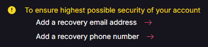
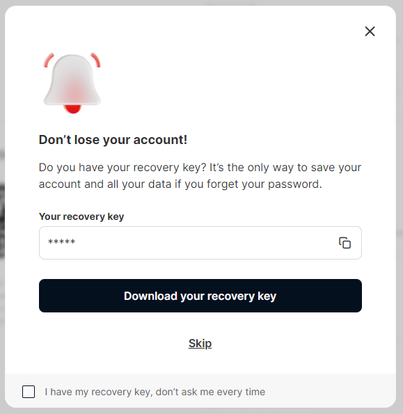
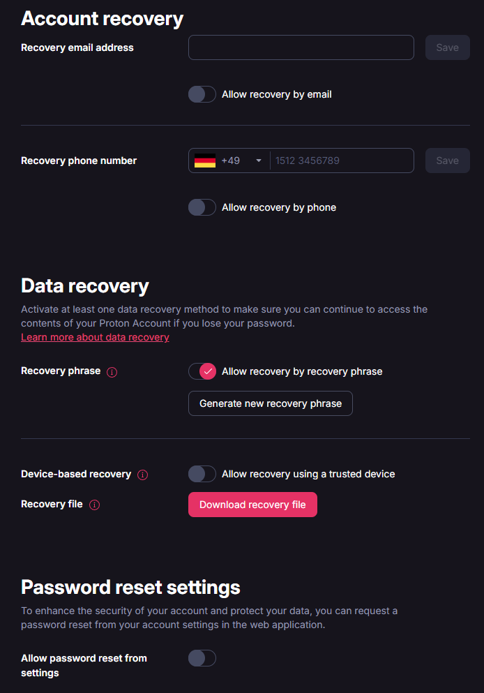
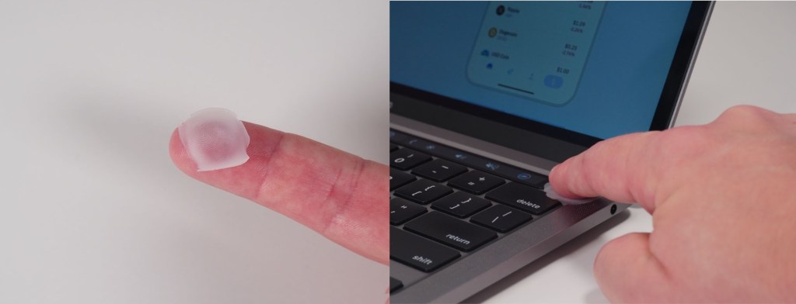
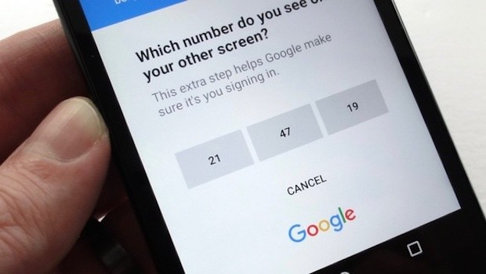
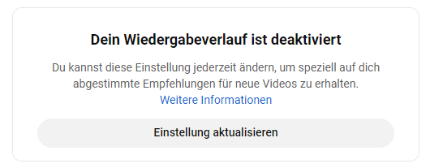
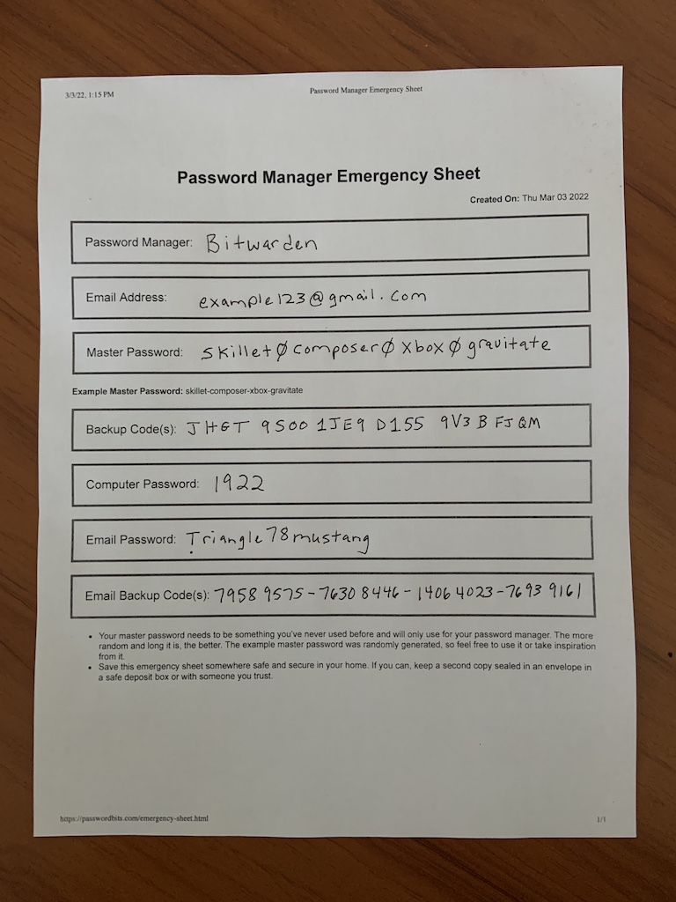

- What to consider about tech security, privacy (and backups)
- Regarding the topics
  - Address/post
  - Phone
  - Email
  - Documents
  - Web
  - Password
  - Payment
  - Device

<!--more-->

## Dangers of neglecting tech security & privacy

### Security
- direct theft of money
- identity theft
  - invoicing purchases to you
  - decreased credit rating
  - account access frozen (payment, other services...)
  - reputational damage
    - crime in ones name
    - sensitive data leaks
    - private professional brand/trust damage
  - exhausting legal battles & doxing/harassment
  - feeling of violation & living in anxiety of attacks yet to happen
- legal (compliance) consequences in case of major neglect
- blackmail & ransom attacks

### Privacy
- contract rejection (medical records, car accidents...)
- deepfake attacks on family
- burglary, cyberstalking etc.

Also see: ["Google: a walk down privacy lane" on CupWire](https://archive.ph/XzrbQ)

### Google Cases

- Stalker
- Fined for still tracking location
- Law enforcement scan

## Future cases

- Contract rejection due to (medical) history

### Phils cases

- Famialy AI call
- Scam SMS
- Phishing simulation
- Ecom Brushing

## Security & privacy in general

### Compartmentalization

- separating data of any kind for different purposes, e.g.
  - work/job
  - personal professional (e.g. personal brand, business, LinkedIn)
  - personal private (e.g. family and friends)
  - personal public (e.g. social, dating, shopping)
  - perosnal sensitive (e.g. health, finance, civil)
- when/where? can be done in most areas, from email over user profiles to even addresses
- benefits
  - organization
  - security: isolation
  - privacy: limiting the potentially exponential value increase of correlating your data across situations

### Pseudonyms

- your "alter egos" for different situations, though one is sufficient for most cases/people
- pseudonym should have own set of all data typically required for registration/contact purposes
  - address
  - birthday
  - phone
  - email
  - credit card
- depending on situation the contact data can be entirely fake or actually forward to you anonymously
- proving plausible fake information has benefit of
  - drawing less attention/suspicion than outright hiding data
  - making profiling harder by producing incoherent data

### Data cleanup

- When in doubt consider that the internet never forgets
- non-EU and especially are noticably more clingy with your data
- Overwriting (sensitive) data with junk is better than removal in many cases
  - given it's often legally sufficient to mark data as "deactivated" rathen then deleting it 
- [Ingocni](https://incogni.com/)
  - maybe try for 1 month for 80% of effect
- [JustDeleteMe](https://justdeleteme.xyz/)
  - check before account creation how "clingy" the company is

### US vs EU: paid options vs laws

- US has more advanced privacy service like [MySudo](https://anonyome.com/individuals/mysudo-plans/)
  - EU has stronger privacy laws that make
    - fewer options less of an issue
    - more extreme methods like SIMless phone less necessary

### Zero-knowledge E2E encryption

- In zero-knowledge or client E2E encryption
  - your auth is used to decrypt the data stored at the provider
  - no unencrypted data ever leaves your device
    - this is the deciding difference to only "server side encryption" where the provider can still all your data with restriction

---

- Red flag: the ability to restore ones access to account data e.g. via recovery link is a sign that the provider has full control over that data
- Adding more alternative ways of auth can never increase "security" as it only increaes possible attack vectors
  - The provider either wants to
    - avoid customer care cases due to lockout
    - or collect more data about you
    - or both

- True zero-knowledge providers will offer no recovery methods on their side other than
  - recovery keys 
  - recovery from a device still logged in to your account
  

- Providers serious about security will allow to disable auth and recovery options
  - so that you can effectively reduce attack vectors and focus on securing the remaining ones

Being locked out because no valid auth can be produced is what security is all about!
If losing your key isn't a big deal because of "convenient account recovery methods" then the account wasn't secure to begin with

### Authentification methods

tl;dr:
- no single method it best in all - secrets, biometrics and hardware keys have unique benefits
- thus layering will yield the highest security
  - e.g. using a remembered password + PIN secured hardware key + fingerprint unlock
    - will be secure against remote and physical attacks
    - eleviates risks of short PINs via longer password while fingerprint unlocks helps keeping it secret   

The following table lists common auth method and their susceptibility to remote and physical attack vectors
- attack vectors are considered in isolation, e.g. given a fingerprint clone a device passkey is not safe on unlocked device. But without it, a passkey is not less secure on an unlocked device

⚪ no known threat
🟢 very low risk
🔵 low risk
🟡 moderate risk
🟠 high risk
🔴 very high risk

| Auth method                     | Brute Force / Dictionary                                  | Phishing (remote)                                                                                   | MITM  (Evilginx) -&gt; session hijacking                                               | Physical Access to locked device (Victim away)                                                                      | Physical Access to locked device (Victim present)                                                           | Physical Access to unlocked device (Victim away 2min)                                                                  | Watching the Victim                                                                                              |
| :------------------------------ | :-------------------------------------------------------- | :-------------------------------------------------------------------------------------------------- | :------------------------------------------------------------------------------------- | :--------------------------------------------------------------------------------------------------------------------- | :---------------------------------------------------------------------------------------------------------- | :--------------------------------------------------------------------------------------------------------------------- | :--------------------------------------------------------------------------------------------------------------- |
| PIN (short but device specific) | 🟢 Protected by wipe/ lockout                            | 🔵 possible, but useless with access to device                                                     | 🟠 anti-malware helps, but PIN + session stolen at same time can auth most actions | 🟡 Keylogger (wired + wireless), as PIN as need to be typed                                                           | 🟢 Physical threat needed                                                                                  | 🔴 Software keylogger etc                                                                                             | 🔴 short PIN easily remembered                                                                                  |
| Password (Manager) + TOTP       | 🟢 changing TOTP                                         | 🔵 unlikely with PW manager autofill[^1] + anti-malware  TOTP prevents re-login / 2FA change | 🟡 anti-malware helps  TOTP prevents re-login / 2FA change                      | 🔵 Keylogger: passwords usually autocompleted + TOTPs invalid after use by victim                                  | 🟢 PIN: Physical threat needed  🟠 Fingerprint unlock:  easily forced  TOTP seed could copied | 🟠 Software keylogger etc (harder without typed password)  TOTP prevents re-login / 2FA change               | 🔵 Password + TOTP need to be spied on and typed fast  TOTP prevents re-login / 2FA change                |
| Passkey                         | ⚪ device-bound credential                                | ⚪ FIDO2/ WebAuthn                                                                                  | ⚪ FIDO2/ WebAuthn                                                                     | ⚪ No access or cloning possible                                                                                       | 🟢 PIN 🟠 Biometric (can be forced/spoofed)                                                            | ⚪ PIN or biometrics required                                                                                          | 🔴 PIN 🟢 Biometric                                                                                         |
| Fingerprint                     | 🟢 "master fingerprints" have low success rate + lockout | ⚪ FIDO2/ WebAuthn                                                                                  | ⚪ FIDO2/ WebAuthn                                                                     | 🟡 optical readers can be spoofed with prints from environment  🟢 capacitive readers need sophisticated clone | 🟠 easily forced and danger of cloning                                                                     | 🟡 optical readers can be spoofed with prints from environment  🟢 capacitive readers need sophisticated clone | 🟡 optical readers can be spoofed with photos of fingers  🟢 capacitive readers need sophisticated clone |
| Face                            | 🟢 "master face" have low success rate + lockout         | ⚪ FIDO2/ WebAuthn                                                                                  | ⚪ FIDO2/ WebAuthn                                                                     | 🟢 no known biometric face spoofing/ cloning                                                                          | 🔴 very easily forced                                                                                      | 🟢 no known biometric face spoofing/ cloning                                                                          | 🟢 no known biometric face spoofing/ cloning                                                                    |
| Hardware Key + Fingerprint/PIN  | ⚪ hardware key                                           | ⚪ FIDO2/ WebAuthn                                                                                  | ⚪ FIDO2/ WebAuthn                                                                     | ⚪ No access or cloning possible                                                                                       | 🟢 PIN 🟠 Biometric (can be forced/spoofed)                                                         | ⚪ hardware key + FIDO2/WebAuthn                                                                                       | 🔵 PIN 🟢 Biometric                                                                                         |

[^autofill]: Specify valid target URL with your passwords so that your PW won't be able to autofill on pishing websites

#### PINs, passwords and other short secrets

- PINs serve to keep more powerful auth methods like passwords protected and usually allow only common usage of accounts but not e.g. changing security settings
  - while passwords usually allow unlimited attempts, PINs lock or erase devices after around 10x attempts
- offer the possibility of (plausible) deniability
- PINs especially for device unlock usually need to be typed (as device is locked), so there's a constant risk if them being seen
- privacy screens and keypad scrambling can make spying harder
- less recommended in public for regular unlocks as eventually people will see and remember
- as forgetting them is common, customer care is more likely to bypass/disable them to help "the customer" regain access

- password manager tricks
  - you can use 2 password managers for additional security multiple ways
    - split all passwords in two parts and store them in different managers
    - store important passwords in one and rest in the other manager
    - store passwords in one and TOTPs in other manager
  - store most important passwords only partionally and remember
  - peppering: split (important) passwords into the password saved in the manager + a random string at the end that you keep in mind, e.g.
    - Amazon PW: 6ybhLNKW**g8e3**
    - Zalando PW: jte4nYWH**g8e3**
- you might want to keep important passwords only on paper or in mind to elimate threat of data leaks

#### Passkeys

- ⚠️combination of username + password + "2FA" functionality presents a single point of failure
  - though not all services do it like this
  - undermines the whole MFA concept
  - enables attackers to unlock your accounts "without even knowing the keyhole"
    - this is relevant for passkeys on devices not immediate tied to you:
      - e.g. your Amazon passkey on a hardware key: if lost in public and without PIN, attackers can just try popular sevices like Amazon and see what account it unlocks
- though device specific, password managers can also store them to enable cross device usage
  - this can actually increase security, as PWMs allow you to put additional PIN/biometrics auth in between

#### Biometrics

- recommended to disable during protests etc. because law enforcement can force unlock easily
- can't be lost
- but also not replaced once compromised - shouldn't be considered a secret but rather similar to a username
- older fingerprint readers aren't secure at all. Three current techs are
  - optical (e.g. Google Pixel 8): can be fooled with clones of your finger from photos or even prints off the device they secure
  - capacitive: will also consider the depth profile of your finger and can come with "liveness checks" to prevent spoofing e.g. via clones made of glue
  - ultrasonic (e.g. Google Pixel 9): further enhances geometric checks etc. 

> "It’s important to note that all fingerprint sensors we tested were susceptible to high quality spoofed fingerprints created with a cooperative enrolled user, including those in popular phones and laptops, and the one in the YubiKey Bio. We believe with sufficient skill and practice that this can be done even with latent prints without the cooperation of the enrolled user. An example of this was demonstrated at the Chaos Communication Congress by using photographs of hands to create a spoof of the enrolled user’s fingerprints. However, the vast majority of potential attackers are not physically near to their victims and do not have physical access to their devices."
> https://www.yubico.com/blog/getting-a-biometric-security-key-right/

https://www.bleepingcomputer.com/news/security/biometric-auth-bypassed-using-fingerprint-photo-printer-and-glue/

#### Hardware keys

- provide the highest security overall and also against most attack vectors individually
  - especially if additionally secured with PIN or biometrics
- some hardware keys can also be used to generate TOTPs (in conjunction with smartphone)
- for better or worse, true hardwara auth (FIDO2 etc.) cannot be cloned, so you need dedicated backups keys or methods to not loose access

#### MFA

- generally MFA should be realized via entirely separate devices
  - e.g. malware on same computer could compromise PWM 1 for passwords and PWM 2 for TOTPs at the same time
- MFA also protects against social engineering attacks against customer care
- Even in case of successful session hijacking with compromised password, MFA will usually prevent any security related account changes that could e.g. lead to total account takeover
  - this works both ways: if an attacker gains access to password + MFA, they can remove your backup MFA methods to lock you out effectively

- SIM is the worst due to the 
  - unsafe (unencrypted) protocol
  - threat of SIM hijacking out of your control
- Email is reasonably safe given high email account security is recommended anyways
  - possible damage is high as password + 2FA security could be compromised at the same time for many accounts
- TOTPs depend on the security of the device where they're generated
  - backup and use across devices is easy
- Device prompts
  - usually ensure device isolation as they are device specific
  - should be pretty pishing resistant, as device prompts e.g. happen outside of browser
  - though promts without confirmation on unlocked devices can be dangerous
    - especially with many devices, e.g. people had their kids confirm promts without them knowing
- Hardware keys etc. are ideal, as they are dedicated offline devices that can additionally be secured via PIN/biometrics 

https://news.softpedia.com/news/google-now-allows-g-suite-admins-to-roll-out-sign-in-prompts-to-all-phones-523120.shtml

- MFA backups can also be given to e.g. family and friends as MFA on it's own is useless 

#### General

- Keep automatic locking e.g. for device screen, password managers as short as possible to limit the attack surface on unlocked devices/accounts
- The more you use you most secure methods (e.g. hardware key, master-master key for password manager) also for unimportant stuff, the higher the exposure to attacks

## Security & privacy per topic

### Address/post

Caveats
- legal requirements for a physical address ("ladungsfähig") in certain cases like business mail
  - operating e.g. own blog or business without this can get you fined

#### Providers/Services

| **Service**                                                                      | **Cost**      | **Description**                                                   | **Providers**                                                                                                                                     | **Supports Name Anonymization** | **Supports Packages** | **Legal Physical/Business Address** | **Other Notes**                                                                      |
| -------------------------------------------------------------------------------- | ------------- | ----------------------------------------------------------------- | ------------------------------------------------------------------------------------------------------------------------------------------------- | ------------------------------- | --------------------- | ----------------------------------- | ------------------------------------------------------------------------------------ |
| [**"Postfach"**](https://www.deutschepost.de/de/p/postfach.html)                 | ~30€/year     | "Postfach" locker inside Post offices - no forwarding             | Deutsche Post                                                                                                                                     | No                              | No                    | No                                  | - More secure as harder to intercept than home mail. - Mail needs to be picked up |
| **Packing stations**                                                             | Free          | For packages, nothing else                                        | [DHL](https://www.dhl.de/de/privatkunden/pakete-empfangen/an-einem-abholort-empfangen/packstation/empfangen-packstation.html), UPS, Amazon Locker | No                              | Yes                   | No                                  |                                                                                      |
| **Imprint services**                                                             | ~5-20€/month  | Physical address for legal requirements, e.g. blogs or businesses | e.g. [Autorenservices](https://www.autorenservices.de/impressums-service/)                                                                        | Yes                             | No                    | Yes                                 | Mail forwarding usually costs extra.                                                 |
| **Scan and forwarding services**                                                 | ~10-40€/month | Full aliasing and convenience/ digitization service               | e.g. [Clevver](https://www.clevver.io/de/produkte/clevvermail-postdigitalisierung/#prices), [Dropscan](https://www.dropscan.de/preise/privat)  | Yes                             | Yes 💵               | Yes 💵                             | Still not suitable for all kinds of personal mail, e.g. tax confirmations.           |
| [**"Nachsendeservice"**](https://www.deutschepost.de/de/n/nachsendeservice.html) | ~30€/6 month  | Forwards mail from one address to another for up to 6 months.     | Deutsche Post                                                                                                                                     | No                              | No                    | No                                  | Explicitly forbids use for address anonymization.                                    |

### Phone number

#### Security
- phone numbers are not only security relevant indirectly via communiction (see social engineering) but nowadays also directly e.g. in MFA
  - e.g. in Germany especially critical services like bank, health insurance like to only offer SIM MFA without alternative
  - SIM hijacking is hard to defend against as fraudsters often use attack vectors out of the users control, like SIM provider customer support
    - depending on the attack (and e.g. personal use of the SIM), a SIM transfer is hard to notice just by absence of incoming calls/SMS
  - phone numbers can often be considered as significant proof of identity, thus can play a role in identity theft
    - your voicemail can be enough to clone your voice for an AI to impersonate you    
- phone calls an SMS are inherently insecure because unencrypted, making eavesdropping trivial given certain hardware
  - treat them like public conversations

#### Privacy
- Mobile network providers can track your location accurately via cell phone tower triangulation while identifying your via your SIM IMEI
  - e.g. in US network providers routinely sell this information
- SIM cards actually funtion as small individual computers, using the phones hardware but bypassing the software (e.g. VPNs -> split tunneling) [^SIMcomputer]
- not all countries allow anonymous SIM purchase
- dedicated privacy measures probably not necessary in EU thanks to data protection laws

[^SIMcomputer]: https://youtu.be/RyirQOCUUK8?feature=shared&t=156

#### Mitigation

- airplane mode will prevent location tracking but only SIM removal will stop the SIM doing anything on its own
- use encrypted messengers like [Signal](https://signal.org/) for both text and calls
- deactivate voicemail to prevent voice cloning
- harden your provider account to prevent SIM hijacking
- Compartementalization
  - Having e.g. 5 phone numbers is feasible nowadays
    - pre paid is often sufficient as mainly the number is needed, wifi can handle communication just fine 
    - eSIMs can't all be active at the same time but still be switched and are harder to steal

| Compartment                      | Notes                                                    | Usually on? | Incoming calls/SMS | Outgoing calls/SMS | Data plan |
| -------------------------------- | -------------------------------------------------------- | ----------- | ------------------ | ------------------ | --------- |
| Work + dating/events             | number not expected to be valid for long                 | yes         | All (worktime)     | See compartment    | Main      |
| Family & friends (+ security) | always active. Usable for e.g. banking MFA as well       | yes         | All                | Prefer VoIP        | (Backup)  |
| Security                         | for other or all MFA, possible only turned on explicitly | no          | SMS only           | -                  | -         |
| Service incl. messaging       | public number meant for e.g. registration only           | no          | Reject             | -                  | -         |
| Travel                           | Usually data-only plans                                  | no          | Reject             | -                  | Prepaid   |

### Email

#### Security

- Email is another popular option for MFA and often more secure than SMS as e.g. all email accounts need passwords
- Poses a major attack vector if connected accounts don't use MFA, as email password recovery basically serves as universal password
- With increasing digitalization, email accounts might contain similar amounts of sensitive data than computer or smartphone (shopping, finance, health, political...)
- It easier to impersonate somebody via text than e.g. calls and an email inbox usually contains enough personal information (e.g. address, birthday) to authorize more sensitive processes in your name
- Harder to regain control, as email accounts can be opened anonymously, so there's little legal ownership to begin with
  - With access to similar information as you but control over your account, in the digital world a fraudster will have more authorite over your identify than you
- Free providers often don't encrypt your data (also see privacy), which makes them vulnerable to data leaks
- Some providers reuse deleted addresses, which will at the very least lead to uncomfortable identify switch
- Aliases like "amazon.crested799@passmail.net"
  - protects your main (login) email account address from risks of exposure (spam/data brokers, fingerprinting, hacking etc)
    - your logins turn from something that identify you into a unique secret 
    - for incoming + outgoing messages
    - can be disabled/enabled at will
    - aliases are usually permanently associated with your account and won't get recycled (for security)
    - you'll be able to pinpoint data leaks (hacking or sold data) and better avoid shady services
  - can usually be created in unlimited numbers at small premium
    - effectively circumventing your limit of extra email addresses on your account
  - there's 3rd party provider option, but some providers like Proton Mail offer that feature built-in
  - compared to aliases via custom domain e.g. "amazon.crested799@myrandomdomain.net"
    - offer additional privacy, security and convenience
      - since most domain providers need to ID you
      - eventually there will be a leak to who owns "myrandomdomain.net" e.g. if you use it with services that you also give your address
    - "myrandomdomain.net" comes with additional attack surface and things you can configure incorrectly
      - potentially leading to domain take over or attackers imporsonating you in other ways
    - if your provider doesn't allow unlimited custom domain email addresses, you won't be able to send mails from a majority of aliases (easily)
      - e.g. customer service might reject requests not coming from your actual account email
- some anti-malware software come with plugins for email clients like Thunderbird to enhance e.g. protection against phishing that's often missing in consumer email solutions 

#### Privacy

- Free providers likely sell you data or insights from scanning your mail one way or another
  - With increasing digitization, the possible impact only grows

#### Mitigation

Considering the potentially catastrophic consequences of losing control of ones (main) email account:

- delete/archive (out of account) mail regularly
- MFA should be considered mandatory - hardware keys highly recommended 
- keep your email provider login secret. if you login is your email address, exclusively use it for login, e.g. don't send mails from this addres
- use email aliases for privacy and security
- prefer providers with zero-knowledge encryption

#### Providers/Services

Those were the services which I wanted to compare in detail end 2024. 
Back then I wasn't happy with posteo.de anymore after finding that by design they didn't want to offer MFA together with a usable (3rd) party client e.g. also on mobile.
In the end I decided for Proton due to offering more flexibiliy/integrations (e.g. 3rd party clients) and also built-in aliases. Plus their ultimate account comes with a very good VPN and password manager as well at little additional cost.

Also see [privacytools.io](https://www.privacytools.io/privacy-email) and [techlore.tech](https://www.privacytools.io/privacy-email) for up to date lists of service recommendations

|                 | Price / m | FIDO2 / U2F | Aliases            | Addresses          | Custom domains | PGP | Full-text search | 3rd party clients | Catch all | Cal Share | Auto reply | Auto forward |
| --------------- | --------- | ----------- | ------------------ | ------------------ | ----------------- | --- | ---------------- | ----------------- | ------------ | ------------ | ------------- | --------------- |
| Proton          | 3,5-4€    | x           | 10[^simplelogin]   | 10                 | 1                 | x   | x                | via Bridge        | x            | x            | x             | x               |
| Proton Ultimate | 8-10€     | x           | ♾️[^simplelogin] | 15                 | 3                 | x   | x                | via Bridge        | x            | x            | x             | x               |
| Tutanota        | 3€        | U2F only    | 3rd-party only     | 15 custom: ♾️ | 3              | -   | x                | -                 | x            | x            | x             | -               |

[^simplelogin]: Proton uses simplelogin.io for their alias feature

Alias provider examples:
- SimpleLogin
- AnonAddy
- Firefox Relay

### File Storage

https://www.privacytools.io/encrypted-cloud-storage

 - if you're already using a cloud storage service though without zero-knowledge E2E encryption, switching services is easy and would improve both security and privacy
   - however possibly at the expense of a bit of user experience due to encryption (e.g. file previews are harder to achieve then) 
 - if you're currently not using a cloud storage service, e.g. it's in most cases recommended because
   - having important documents and private project files backuped around to clock transparently is hugely convenient
   - self-hosting has no real advantages over zero-knowledge cloud storage for most
     - unless your needs are special (e.g. require storage >8TB, full control also over metadata)
     - total costs are comparible (electricity, hardware, your time...)
     - if server administration and security isn't your hobby, expect considerable time invest or sub-par security compared to reputable cloud providers
   - makes fulfilling a proper 3-2-1 backup strategy much easier, which is also recommended for high security which in turn depends on secure backups of auth methods
 - while prices per GB drop significantly with more expensive plans, many providers currently max out at 2 TB for private plans
   - from then on storage can often only be increased by much more expensive family or business plans
   - in such cases when you need e.g. more than 6-8 TB, e.g. your fixed effort for server maintenance might make self-hosting more attractive
     - some providers like Google will only show you >2TB plans if you're already on the 2TB plan

#### Providers/Services

| Service     | Price 2TB / month | Price 4TB / month | Max storage                | Versions + restore | Video previews | Mobile 2way Sync           | Foto live upload | Docs (web) | Sheets (web)  |
| ----------- | ----------------- | ----------------- | -------------------------- | --------------------- | ----------------- | -------------------------- | ---------------- | ------------- | ------------------- |
| Proton      | 16€               | 32€               | 3 TB (family)              | x                     | x                 | -                          | x                | x             | -                   |
| MEGA        | 10€               | 16€               | 16 TB                      | x                     | x                 | x                          | x                | -             | -                   |
| Nord        | 7€                | 20€               | 2 TB                       | -                     | -                 | -                          | x                | -             | -                   |
| Cryptomator | + 0€              | + 0€              | depends on storage service | x                     | -                 | depends on storage service | x                | -             | -                   |

- [Cryptomator](https://cryptomator.org/)
  - not a cloud storage on it's own
  - FOSS
  - integrates with most popular insecure cloud storage providers and adds zero-knowledge encryption
    - aside from metadata, this makes it potentially even more secure than alleged zero-knowledge but closed source providers
  - allows mixed operation as well, e.g. store media unencrypted to benefit from Google Photos features, but encrypt the rest
  - usually preserves inherent features of the cloud service like file versioning but also not aways (e.g. file previews)
  - E.g. UK banning ADP beginning 2025 [^uk_adp] is a good usecase example for cryptomator

#### File encryption

- [VeraCrypt](https://www.veracrypt.fr/)
  - OS-agnostic FOSS
  - can manage encrypted containers but also encrypt whole system drives
  - more cumbersome to use than OS-native encryption solutions
  - but also more control e.g. regarding use with cloud storage or plausible denyability encryption
- All popular desktop + mobile OS offer steamlined and barely noticable system encryption
  - desktop system don't have them enabled by default though unlike mobile OS

### Web

#### "Big tech" accounts

- Review security and privacy settings and opt-out whereever you can
  - most apps/services will tell you if a "convenience" feature doesn't work because you restricted permissions
  - consider that "customization", AI etc. features collect data around the clock
    - so in rare cases something you remember as convenient stops working - if you're not willing to spent to time to check why it stopped working it's probably a good privacy tradeoff

#### Browser & search

- the most common computer uses are mainly or can be done using a browser
  - e.g. web surfing & search, news & shopping, email & messaging, music & video, documents & meetings
- security:
  - updates (browser + plugins!)
  - plugin (permission) minimalizm
  - strong (multi factor) auth
  - script and ad blockers
    - e.g. uBlock Origin or NoScript
    - prevent lots of automated attacks (scripts) and attacks on human users (pop ups etc.)
  - plugin from anti-malware software
    - blocks malicious sites, scripts, downloads...
  - enforce HTTPS
    - e.g. HTTPS Everywhere
- browsers and search engines controlled by big tech are in a great position to track you anywhere on the internet (even against your non-consent)
- search engines (or any search field) basically see what you think throughout the day, which might be more sensitive than data on what you actually do
- switching to a more secure and private browser and search is both easy and quite relevant
  - advantages
    - blocks trackers, ads, malicious scripts
    - less data collection e.g. via telemetry, cloud backup
    - enforces HTTPS
    - open source: potentially more secure

https://www.privacytools.io/private-browser
https://www.privacytools.io/private-search

- privacy frontends [^privacyfrontends]
  - unfortunately there's no real alternative to some services like YouTube, especially social media in general
  - privacy frontends or proxies can serve as intermediate layer between you and the service in questions
    - often at least theoretically possible if the service in generally free to access
    - they e.g. hide your traffic among the collective of other anonymous users
    - even user profiles can be supported
    - proxy solution work in more cases but incur server costs, thus usually require self-hosting for a good experience

[^privacyfrontends]: https://www.privacytools.io/privacy-frontends

#### VPN vs DNS

- In both cases the provider can see all your traffic metadata and even data unless it's E2E encrypted e.g. via HTTPS
- Both work like a proxy by handling part of your internet traffic for you
  - VPNs 
- Compared to HTTPS, VPNs encrypt all traffic, so even your ISP can only see metadata of your connection the to VPN

|                      |                                           | VPN                                                                             | DNS                                                 |
| -------------------- | ----------------------------------------- | ------------------------------------------------------------------------------- | --------------------------------------------------- |
| Security             | Full traffic encryption (even for ISP) | 🟢Always                                                                       | 🔴Never                                            |
|                      | Malicious site blocking                   | 🟢Provided by most decent providers                                            | 🟢Provided by most decent providers                |
| Privacy              | Ad/traffic-block                          | 🟢Provided by most decent providers                                            | 🟢Provided by most decent providers                |
|                      | IP spoofing                               | 🟢Always                                                                       | 🔴Never                                            |
| Speed                |                                           | 🟡Even fastes VPN can struggle with HD streaming                               | 🟢Can be even faster than without                  |
| Cost                 |                                           | 🟡~ 5€ / month                                                                 | 🟢~ 2€ / month                                     |
| Device compatability | Devices supporting apps                   | 🟢Almost always                                                                | 🟢Almost always                                    |
|                      | Smart device without apps                 | 🔴VPN support rare                                                             | 🟢usually still yes                                |
| Streaming support    | Speed / traffic                           | 🟡Usually only more expensive VPNs support streaming with good user experience | 🟢Always                                           |
|                      | Bypass geoblocking                        | 🟢Works in most cases given decent provider                                    | 🔴Highly depends on DNS provider and streaming app |

- VPN "split tunneling"
  - can be an explicit feature, e.g. to bypass geoblocking in some cases but ensure fast traffic for everything else
  - can be involuntary, usually on hardware/OS level, e.g. SIM cards can bypass a phones active VPN
    - can be prevented by connecting device in question to internet only via another device with active VPN, e.g. a mobile hot spot [^calyxinternet]
      - this trick enables powerful firewalling as well, as it separates connection control from the apps that run malicious code (tracking etc.)

[^calyxinternet]: https://calyxinstitute.org/membership/internet

### Payment

- payment security/privacy is usually about trusting a single (3rd party) provider a lot as proxy 
  - so that you don't need to trust others anymore
- secure payment aspects
  - payment auth prompt: auth should be required for all (non-reoccurring) payments e.g. independent of amount
    - one could argue though if max auth method is weak (e.g. optical fingerprint)
  - single use credit cards/payment token or burner cards: alternative to "always auth" by preventing payment info reuse
    - single use cards cannot be used for reoccurring payments
    - burner cards: ability to quickly create and destroy virtual cards
  - tokenization / proxy: only token card or proxy account visible to outside (passing payments to linked accounts/cards)
    - Token: always changes
    - Proxy: static
  - prepaid: prevent payments beyond intended balance
  - disable credit: prevent payments beyond intended balance
  - quickly freeze: lock cards/accounts in near real-time because lost or preventively only ever unlock before intended payment
    - of course removal of payment methods is almost always possible, though cumbersome
  - daily/monthly limits: prevent use of unreasonable large amounts in a short time
  - country/shop/online permissions: only allow or lock payments in certain cases
  - ⚠️GPay currently doesn't offer payment confirmation on desktop!

| **Criteria**                             | **DKB Debit Card**                                                                    | **Google/Apple Pay etc**        | **PayPal**                                            | **VimPay Go**                                                                         | **Revolut**                                                                                 |
| ---------------------------------------- | ------------------------------------------------------------------------------------- | ------------------------------- | ----------------------------------------------------- | ------------------------------------------------------------------------------------- | ------------------------------------------------------------------------------------------- |
| **Max payment auth**                     | 🟡App PIN / biometrics  🟢Chip TAN (MFA)                                      | 🟡Phone unlock                 | 🟢Password + hardware key (MFA)                      | 🟡PIN / biometrics                                                                   | 🟡PIN (random keypad) / biometrics                                                         |
| **POS auth promt**                       | 🟡 Only above/every 50€, though sometimes randomly below  Cannot be changed | 🟢Always  Can be toggled | 🟡  Locks after rather short time                 | 🟡 Only above/every 25€, though sometimes randomly below  Cannot be changed | 🟢Always                                                                                   |
| **Single-use cards / tokens**            | 🔴No                                                                                 | 🔴No                           | 🔴No                                                 | 🔴No                                                                                 | 🟢Yes                                                                                      |
| **Tokenization / proxy**                 | 🔴No                                                                                 | 🟢Tokenization                 | 🟢Proxy                                              | 🟢Proxy                                                                              | 🟢Both possible                                                                            |
| **Prepaid**                              | 🔴No                                                                                 | Depends on linked account       | 🟢Yes, can chose for every transaction               | 🟢Yes                                                                                | 🟢Yes                                                                                      |
| **Disable overdraft**                    | 🟢Yes, on request                                                                    | Depends on linked account       | 🟢-> Prepaid  Proxy: Depends on linked account | 🟢-> Prepaid                                                                         | 🟢-> Prepaid                                                                               |
| **Real-time freeze cards**               | 🟢Yes, via app                                                                       | Depends on linked account       | 🟡No (need to remove method)                         | 🟢Yes, via app                                                                       | 🟢Yes, via app                                                                             |
| **Daily/monthly & max amount limits**    | 🔴 Only max bank transfer limit -> no payment limit                               | Depends on linked account       | 🔴No                                                 | 🟢 Daily / weekly / monthly caps  Contactless limits                        | 🟢 Daily / monthly caps                                                                 |
| **Payment feature / permission toggles** | 🟢 - Country - Online pay - POS pay - Contactless - Cash withdrawal   | Depends on linked account       | 🔴-                                                  | 🟡 - Country - Online pay - Contactless                                     | 🟢 - Country - Online pay - Contactless - Cash withdrawal - Magstripe swipe |

### Device

- Privacy control (e.g. app permissons) and security (e.g. sandboxing) better on iOS/Android compared to desktop

#### All devices

Tier 1 - slightly inconvenient at worst
- Minimalism regarding apps 
- Go through all app and OS settings and assign minimal permissions, especially for camera, location, microphone
  - Especially (precise) location - even Google Maps works fine in most cases without
- OS native device encryption
- Disable notifactions details on lock screen
- Remote tracking/lock/wipe, though consider tradeoff:
  - native solutions require account with ecosystem provider (e.g. Google/Apple Find My Device), significantly decreasing privacy (personalized telemetry, location data...)
  - 3rd party solutions (e.g. malware protection) might work worse and you're opening yet another attack vector (security + privacy) 
- prefer web (browser) apps over native device apps
  - most apps that don't require special hardware (mic, camera, GPS is e.g. fine) work just fine as web apps or in the browser
  - but have a lot less control over your device e.g. to track you
- if you're a reasonably educated user, the OS built in malware protection (even Windows Defender) should be enough
  - doesn't open additional privacy attack vectors
  - free anti-virus come with privacy issues but little additional value

Tier 2 - taking it seriously
- Use FOSS
  - Store apps are usually full of trackers, check Exodus [^exodus]
  - Check alternative.to for app alternatives
  - Especially relevant for utility apps that see your sensitive information all the time, e.g. keyboard or voice recording apps
- Get apps from official stores for security, but not directly to preserve privacy
  - Android: F-Droid, Aurora
  - Windows: UniGetUI, Scoop
- Disposable browser: for searches etc. (deletes history when closed)
- Consider using multiple accounts (user, browser...) to compartementalize use cases
- Backups: disalbe all native backup features and manage yourself, unless zero-knowledge encrypted like with iCloud ADP
- Privacy screen
- Secure connection (VPN)
  - Firewalls like NetGuard unfortunately occupy the VPN slot, which is usually a worse option (especially if using FOSS, where firewall benefit is less)

Tier 3 - paranoid/high threat model
- Lock device based on distance to wearables
  - Unfortunately requires e.g. Android Tasker/Automate[^androidautomate] routine or something like BusKill [^buskill]
- Tape camera
- strong device auth/password
  - no biometrics at airports, protests etc.
- Try to not link with cloud account (Google, Apple, Microsoft...)
- Remove on-board microphone and only use external headphone mic

[^androidautomate]: https://play.google.com/store/apps/details?id=com.llamalab.automate
[^buskill]: https://www.buskill.in/

#### Mobile

Tier 1 - slightly inconvenient at worst
- Don't root etc.
- Automatic updates
- iOS: Enable cloud encryption aka "advanced data protection" (ADP)
  - UK banned ADP beginning 2025 [^uk_adp]

Tier 2 - taking it seriously
- Most messengers, even WhatsApps, is considerably more private and especially secure than SMS
- Protect SIM with password
- iOS: Enable lockdown mode [^lockdownmode]
- Use mobile in combination with hardware key for isolated TOTPs
- Device lock with fingerprint, app lock with PIN
  - iOS doesn't support 3rd party app locks
- MAC address randomization
  - careful if you set your router to only allow connections from known devices

Tier 3 - paranoid/high threat model
- Go into airplane mode (SIM + Bluetooth) if possible and only use WiFi for data and (VoIP) calls 
- Remove SIM or at least use mobile access point
- Android: disable all sensors via developer options
- OS: custom privacy ROM like [GrapheneOS](https://grapheneos.org/) or [CalyxOS](https://calyxos.org/)
- Remove bloatware and unnecessary system apps with e.g. [ADB AppControl](https://adbappcontrol.com/en/)

[^exodus]: https://exodus-privacy.eu.org/
[^lockdownmode]: https://support.apple.com/en-euro/105120
[^uk_adp]: https://www.youtube.com/watch?v=AuqOzn9GWTU

#### Desktop

Tier 1 - everybody
- Use only local account

Tier 2 - taking it seriously
- Use OS hardening scripts: https://privacy.sexy/
  - Windows: https://hotcakex.github.io/
- User account compartementalization, at least:
  - separate admin account
  - separate work account

Tier 3 - paranoid
- OS: QubesOS or TailsOS

## Phils app picks

- VPN: Proton
- DNS: NextDNS
- Browser: Brave
- Search: Brave, DuckDuckGo
- Privacy Frontends:
  - YouTube: Invidious
- Maps: OsmAnd
- Email & Calendar: Proton (incl. SimpleLogin)
- Docs: CryptPad, OnlyOffice (, soon: Proton?), Obsidian
- App Store:
  - Windows: UniGetUI, Scoop
  - Android: F-Droid, Aurora
  - Mac: brew
- Secrets:
  - Bitwarden (PW)
  - Proton (MFA)
- Cloud Storage: MEGA, Proton
- Messenger
  - WhatsApp (public)
  - Matrix/Element, Brave Talk (family)
- File Encryption: VeraCrypt, 7-Zip, Cryptomator
- OS (privacy tools)
  - Windows: O&O ShutUp
- Firewall
  - Windows: Portmaster
- Domain: Hostinger

## Backups

### General

- proper security will not only lock out attackers, but also you if you lose control over your auth methods
  - it's important to think about (auth) backups before locking down your data and accounts

### Emergency sheet

Source: https://passwordbits.com/password-manager-emergency-sheet/

- something might happen to you or your memory
  - you should ensure access to your secrets managers in plain text:
    - logins/usernames 
    - passwords
    - 2FA recovery codes
  - alternatively you could use e.g. a biometric hardware key
    - (as backup, not primary login, to avoid single point of failure)
  - in any case you need to ensure you or a trusted person knows where to find and how to use the backup
    - dead man switch can be used for automation
    - sheet can be split in two and one half given to trusted person to avoid single point of failure

### Emergency access

- Offered e.g by password managers
- Trusted emergency contacts (TEC) usually must first accept
- TECs can then request access to your vault, which will be automatically granted after delay
  - you can choose a delay, e.g. 14 days
  - a notification informs you about access requests, which you can manually reject 
- E.g. see for Bitwarden: https://bitwarden.com/help/emergency-access/

### Dead man switch

Source: https://www.dvg-duisburg.de/die-dvg/wissenswertes/totmann

- Dead man switches (DMS) are designed to trigger when no human reaction is detected in a certain amount of time
  - E.g. in the physical world a train switch must be pushed so that the automatic brakes don't engage
- DMS are commonly used to
  - execute a local script like a forced shut down or similar to secure a device
    - e.g. DIY: https://github.com/flowchartsman/deadman
  - send a message
    - e.g. self-hosted: https://github.com/storopoli/dead-man-switch
    - e.g. Saas: https://www.deadmansswitch.net/
    - e.g. as scheduled email that you push every week: https://proton.me/support/schedule-email-send

### 3-2-1 backup method

- **3x copies**: primary working copy + 2 backups
- **2x storage media**: e.g. local disk + cloud
- **1x offsite** e.g. external drive or cloud

For example my strategy:

| Type       | Primary             | Media                 | Location                                   |
| ---------- | ------------------- | --------------------- | ------------------------------------------ |
| Services   | Online service data | Local manual backup   | Local backup in cloud                      |
| Devices    | Device data         | External drive backup | Cloud backup                               |
| PW + Login | Bitwarden (cloud)   | Raw dump              | Bitwarden (local) OR  raw dump in cloud |
| 2FA: FIDO  | Yubikey 1           | Yubikey 2 TOTP        | Yubikey family                             |
| 2FA: TOTP  | Proton (cloud)      | Raw dump              | Proton (local) OR raw dump in cloud     |